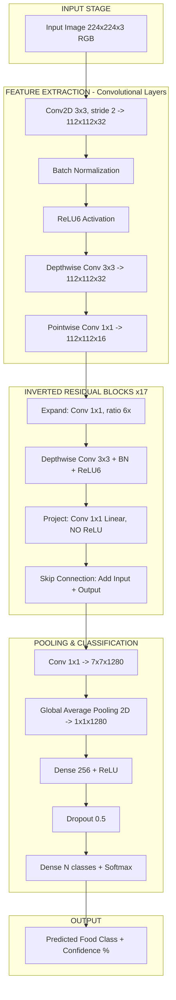
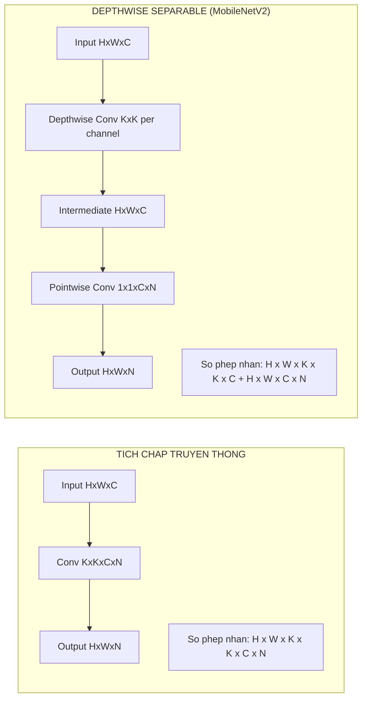
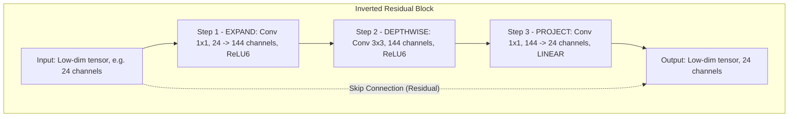
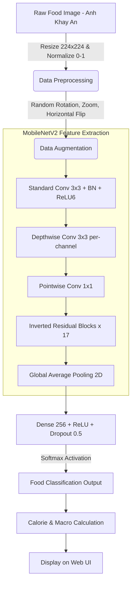
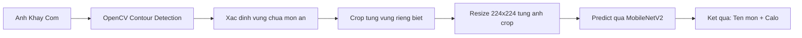
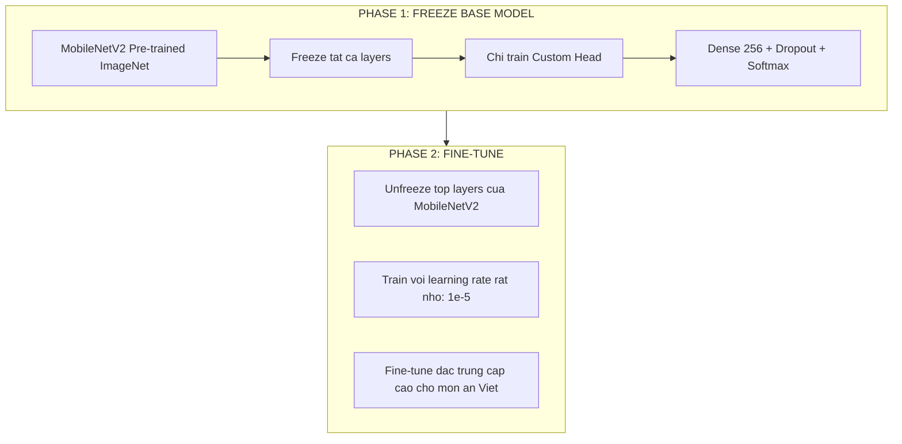
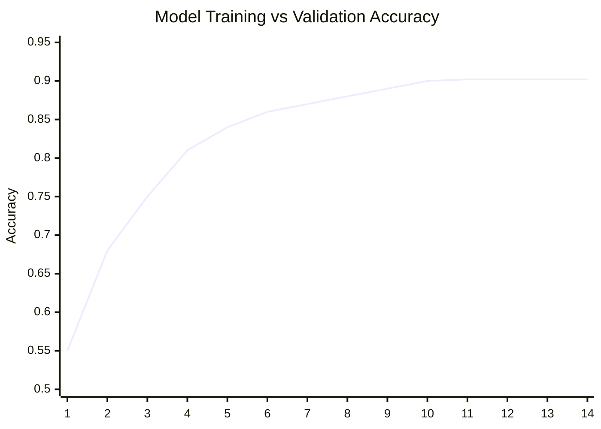
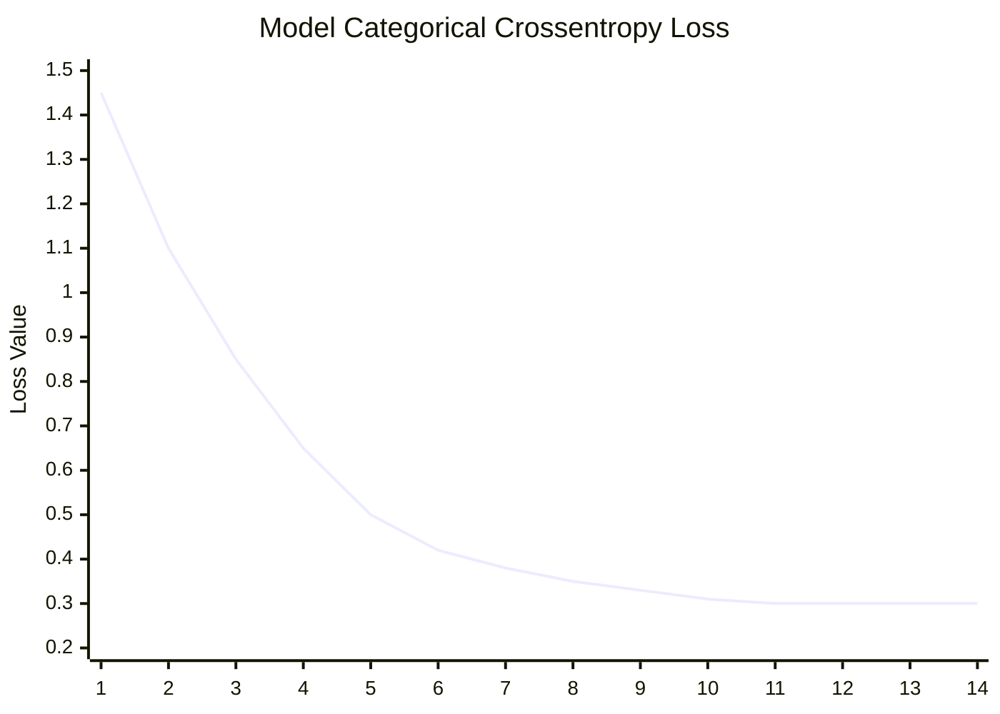
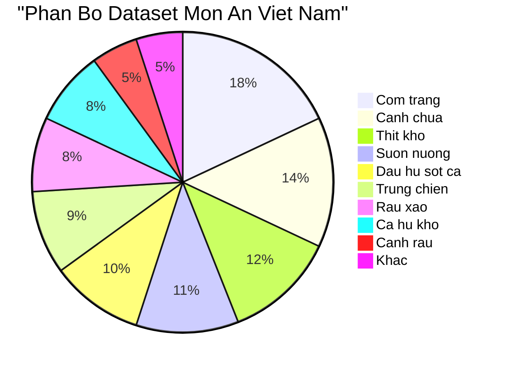

# FoodVision-Ai: He Sinh Thai Dinh Duong & Suc Khoe Thong Minh


FoodVision-Ai la mot sieu nen tang suc khoe ung dung **Tri Tue Nhan Tao (Computer Vision & Deep Learning)** tien tien nhat hien nay. Khong chi dung lai o viec nhan dien do an, he thong con di sau vao phan tich he vi sinh vat duong ruot, giai ma gen (DNA) va sinh trac hoc de thiet ke ra nhung che do dinh duong mang tinh ca nhan hoa tuyet doi. Nen tang con tich hop **Preny AI** – mot chatbot AI ben thu ba hoat dong 24/7 de tu van dinh duong theo thoi gian thuc.

---

## Tech Stack & Frameworks

Duoc xay dung tren he sinh thai cong nghe da nen tang toi uu:

### Hoc Sau & Tri Tue Nhan Tao (Machine Learning & AI)


### Giao Dien Hien Dai (Frontend & UI/UX)


### Tich Hop AI Ben Ngoai (3rd-Party AI Integration)


### Thiet Ke He Thong (Design System)


---

## Tong Hop Toan Bo Tinh Nang (All Features)

FoodVision-Ai duoc xay dung voi **15+ module** tinh nang hoan chinh, chia thanh 6 nhom chuc nang chinh:

---

### NHOM 1: Trang Chu & He Thong Dieu Huong

#### Dang Nhap / Xac Thuc (Login)
- Trang dang nhap voi giao dien toi gian, sang trong.
- He thong quan ly phien (session) thong qua hook `useUser`.
- Luu tru thong tin nguoi dung: Ten, Avatar, Muc tieu suc khoe (Giam can / Tang co / Duy tri).
- Tu dong chao theo thoi gian thuc: "Chao buoi sang", "Chao buoi trua", "Chao buoi chieu", "Chao buoi toi".

#### Bang Dieu Khien Chinh (Dashboard)
- **Bento Grid Layout**: Bo cuc dang luoi Bento hien dai, hien thi tong quan suc khoe trong ngay.
- **Bieu do Calo hinh vong tron (Donut Chart)**: Hien thi SVG dong luong Calo con lai / da nap trong ngay voi animation vong tron tien triet.
- **Bang theo doi Macro (Macronutrients)**: Protein (Dam), Carbs (Tinh bot), Fats (Chat beo) – hien thi theo dang thanh tien trinh truc quan.
- **4 the chi so nho**: Luong nuoc (1.2/2.5L), Calo da dot (450 kcal), Buoc chan (4,230), Chuoi ngay lien tiep (7 ngay).
- **Phan tich Thong Minh AI (AI Insights)**: Nhan xet tu dong tu AI ve che do an uong, canh bao neu ban an qua nhieu chat beo hoac duong.
- **Lich trinh hom nay (Timeline)**: Hien thi dang timeline tung bua an theo gio (08:00 - Bua sang, 12:30 - Bua trua...) voi hieu ung ping hoat hinh cho bua can ghi nhan.
- **Bua an gan day**: Carousel ngang cuon duoc (horizontal scroll) hien thi cac mon an da quet gan day kem hinh anh, ten mon, luong calo.
- **Goi y hom nay (Chef's Pick)**: AI de xuat mon an noi bat trong ngay kem hinh anh va cong thuc.
- **Cong dong (Community Marquee)**: Bang chuyen Marquee tu dong cuon vo han, hien thi cac mon an trending duoc cong dong quet nhieu nhat.

#### Banner Slider
- Carousel tu dong chuyen slide (5 anh Banner quang cao).
- Ho tro chuyen slide bang nut bam va indicator cham tron.
- Hieu ung fade-in / fade-out muot ma.

---

### NHOM 2: Phan Tich Thuc Pham Bang AI

#### May Quet Thuc Pham AI (Food Scanner - `/scanner`)
- Giao dien upload anh hoac chup truc tiep tu camera.
- **Object Detection**: Mo hinh CNN (MobileNetV2) nhan dien tung mon an tren khay com.
- **Image Segmentation**: Boc tach, cat rieng tung vung chua mon an tren anh khay (su dung `crop_tray.py`).
- Tu dong quy doi ra: Tong Calo (kcal), Protein (g), Carbohydrate (g), Fat (g) cho moi mon.

#### Ket Qua Nhan Dien (Detection Result - `/detection-result`)
- Hien thi ket qua phan tich chi tiet sau khi quet anh.
- Danh sach tung mon an duoc nhan dien kem do tin cay (Confidence Score: %) cua thuat toan.
- Bang dinh duong tong hop cho toan bo khay com.

#### Tro Ly Thuc Te Ao (AR Vision - `/ar-vision`)
- Chieu truc tiep bang thong tin dinh duong noi len khong gian thuc (Augmented Reality) ngay canh dia thuc an tren man hinh camera.
- Ho tro xac dinh vi tri dat thuc an trong the gioi thuc.

---

### NHOM 3: Suc Khoe The Chat & Cap Do Te Bao

#### Ho So Dinh Duong DNA (DNA Nutrition - `/dna-nutrition`)
- **Truc quan hoa chuoi xoan kep DNA 3D**: Su dung `React Three Fiber` (Three.js) + Bloom Post-processing de tao hieu ung phat sang Neon cho cac hat gen xoay vong trong khong gian 3D.
- Phan tich do nhay cam gen di truyen: Cafein, Lactose, Gluten, nguy co Tieu duong, toc do Chuyen hoa...
- De xuat thuc don ca nhan hoa dua tren ma gen ca nhan.
- Tich hop phan tich He vi sinh vat duong ruot (Gut Microbiome).

#### Sinh Trac Hoc Hinh The (Biometric Scan - `/biometric-scan`)
- Quet body de tinh toan: Ty le mo co the (Body Fat %), Khoi luong co nac (Lean Muscle Mass).
- Cac chi so suc khoe: BMI (Chi so khoi co the), BMR (Ty le trao doi chat co ban), TDEE (Tong nang luong tieu hao hang ngay).
- Danh gia voc dang va dua ra nhan xet.

#### Co May Thoi Gian Suc Khoe (Health Timelapse - `/health-timelapse`)
- Mo phong hinh anh 3D ve voc dang co the ban trong tuong lai (3 thang, 6 thang, 1 nam).
- Dua tren che do an uong hien tai, cuong do tap luyen, va muc tieu suc khoe.
- Trinh chieu animation tien trinh thay doi theo thoi gian.

---

### NHOM 4: Quan Ly Che Do An Uong

#### De Xuat Thuc Don Tu Dong (Meal Recommendations - `/meal-recommendations`)
- Thuat toan Meal Planning lap ke hoach an theo tuan.
- Ho tro moi muc tieu: Giam can (Cutting), Tang co (Bulking), Duy tri, An chay (Vegan), Keto, Low-Carb.
- Tinh toan dua tren TDEE va BMR ca nhan.
- Danh sach cong thuc kem hinh anh mon an minh hoa.

#### Nhat Ky Dinh Duong (Meal Diary - `/diary`)
- Theo doi luong Calo nap vao (Calories In) va tieu hao (Calories Out) theo bieu do thoi gian thuc.
- Ghi nhan tung bua an theo ngay, kem hinh anh, thanh phan, va calo.
- Canh bao tuc thoi neu nap qua luong duong / chat beo cho phep trong ngay.
- Nut "Them bua an" nhanh.

#### Phan Tich Dinh Duong Tong Hop (Nutrition Analytics - `/nutrition-analytics`)
- Bieu do xu huong dinh duong theo tuan / thang.
- So sanh ty le Macro thuc te vs muc tieu.
- Danh gia hieu qua che do an uong.

#### Phan Tich Chuyen Sau Vi Luong (Deep Nutrition Analytics - `/deep-nutrition-analytics`)
- Khong chi do da luong (Macro), he thong do luong chuyen sau vi luong (Micro-nutrients).
- Theo doi: Vitamin A, B1, B2, B6, B12, C, D, E, K, Canxi, Sat, Kem, Magie, Kali, Natri.
- Phat hien suy dinh duong an (Hidden Malnutrition).
- De xuat bo sung thuc pham giau vi chat thieu hut.

---

### NHOM 5: Tien Ich Doi Song & Tich Hop AI

#### Tu Lanh Thong Minh (Smart Fridge - `/smart-fridge`)
- Nhap danh sach nguyen lieu con sot lai trong tu lanh.
- AI se tao ra hang chuc cong thuc nau an ngon mieng tu nhung nguyen lieu do.
- Loai bo hoan toan lang phi thuc pham (Zero-Waste Cooking).
- Goi y theo khau vi va muc tieu dinh duong.

#### Nong Trai Den Ban An (Farm to Table - `/farm-to-table`)
- Quet ma QR de truy xuat nguon goc thuc pham (tu nong trai den ban an).
- Danh gia Carbon Footprint (luong phat thai carbon) cua bua an.
- Uu tien thuc pham ben vung, than thien moi truong.

#### Cai Dat He Thong (Settings - `/settings`)
- Tuy chinh ho so ca nhan: Ten, Avatar, Email, So dien thoai.
- Dat muc tieu suc khoe: Muc tieu can nang, luong calo moi ngay, che do an kieng.
- Quan ly thong bao va quyen rieng tu.

---

### NHOM 6: He Thong Tuong Tac & AI Chatbot

#### Preny AI – Chatbot Tu Van Dinh Duong 24/7
- **Tich hop Preny AI** (https://app.preny.ai) – nen tang chatbot AI ben thu ba.
- Bot ID: `695d289b4738b6de2b2f7808`
- Ngon ngu mac dinh: **Tieng Viet (vi)**.
- Chatbot noi (Floating Widget) xuat hien o moi trang, san sang tra loi tuc thi.
- Tu dong inject qua script embed, khong anh huong hieu nang trang.
- Ho tro: Hoi dap ve dinh duong, goi y thuc don, giai dap thac mac suc khoe.

#### Floating Menu (Thanh Menu Truot)
- Thanh menu truot tu mep phai man hinh voi hieu ung slide-in tu dong (sau 800ms khi vao trang).
- Bieu tuong nhan vat Paimon de thuong lam nut toggle dong/mo.
- Truy cap nhanh: Nhat ky, Thuc don, Thong ke, Cong dong, Cai dat.
- Moi muc co hieu ung hover doi mau rieng biet (hong, xanh la, vang, xanh duong, tim).

#### Navigation Bar (Thanh Dieu Huong)
- **Desktop**: Top App Bar co dinh (fixed) voi logo, dropdown menu "Danh muc" chua 8 muc mo rong, 5 muc dieu huong chinh (Bang dieu khien, May quet, Thuc don, Nhat ky, Cong dong), va avatar nguoi dung.
- **Mobile**: Bottom Navigation Bar co dinh voi 4 muc (Trang chu, May quet, Nhat ky, Mo rong) + nut FAB (Floating Action Button) hinh camera de quet nhanh.
- Hieu ung active state: Highlight muc dang chon bang mau do + font bold.

#### Footer
- Hien thi thong tin doanh nghiep: Dia chi, Hotline (0869 233 973), Email, Gio mo cua.
- So GCNDKKD, Giay chung nhan ATTP.
- Lien ket mang xa hoi: Zalo, Facebook.
- Badge "Da thong bao Bo Cong Thuong".
- Chinh sach hoat dong, Chinh sach bao mat thong tin.

---

## Kien Truc Thuat Toan CNN Chuyen Sau (Deep Learning & CNN Architecture)

Loi phan tich hinh anh cua FoodVision-Ai duoc van hanh boi **Mang No-ron Tich chap (Convolutional Neural Network - CNN)** voi kien truc backbone la **MobileNetV2**. Day la mot mo hinh cuc ky phuc tap nhung duoc nen toi uu de co the chay real-time tren thiet bi di dong.

### Giai Phau Thuat Toan CNN trong FoodVision
De may tinh "nhin" va hieu duoc hinh anh bat pho hay mieng thit nuong, mang CNN thuc hien cac cong doan sau:
1. **Convolutional Layers (Lop Tich chap):** Dong vai tro nhu "doi mat" trich xuat dac trung. Cac kernel (bo loc) co kich thuoc 3x3 quet qua buc anh de nhan dien tu cac chi tiet cap thap (duong vien, canh, goc cua dia an) cho den cac chi tiet cap cao (mau vang cua trung ran, soc nuong tren suon).
2. **Activation Function - ReLU6:** Ham kich hoat phi tuyen tinh `f(x) = min(max(0,x), 6)`. ReLU6 giup gioi han dau ra tranh tran so (overflow) tren thiet bi tinh toan han che.
3. **Batch Normalization:** Chuan hoa tung batch du lieu giup on dinh qua trinh huan luyen, tang toc hoi tu va cho phep su dung learning rate cao hon.
4. **Pooling Layers (Lop Gop - Max/Average Pooling):** Thu nho kich thuoc ma tran anh (vi du: 224x224 -> 112x112 -> 56x56...) nham loai bo thong tin du thua, tap trung vao dac trung chinh cua mon an thay vi hau canh (mat ban, doi dua).
5. **Global Average Pooling 2D:** Thay vi Flatten truyen thong, GAP lay trung binh toan bo feature map giup giam parameter va chong Overfitting hieu qua hon.
6. **Fully Connected Layers (Dense Layers):** Lop Dense 256 neurons + Dropout 50% -> Softmax Output dua ra xac suat phan loai (Vi du: 98% Com Trang, 2% Bun).

### So Do Chi Tiet Kien Truc CNN (CNN Layer Architecture)



### So Do Depthwise Separable Convolution (Ky Thuat Cot Loi)

Day la ky thuat giup MobileNetV2 nhe hon 8-9 lan so voi CNN truyen thong:



### So Do Inverted Residual Block



### Tai Sao Lai Chon MobileNetV2?

MobileNetV2 la kien truc CNN thuoc dong "Efficient Models" duoc Google phat trien dac biet cho ung dung di dong:

| Dac diem | CNN Truyen thong (VGG16) | MobileNetV2 |
|---|---|---|
| So tham so (Parameters) | ~138 trieu | ~3.4 trieu |
| Kich thuoc mo hinh | ~528 MB | ~14 MB |
| FLOPs (Phep tinh) | ~15.5 ti | ~0.3 ti |
| Toc do suy luan | Cham (>200ms) | Cuc nhanh (<30ms) |
| Chay tren dien thoai | Khong the | Muot ma |
| Do chinh xac ImageNet | 71.3% | 72.0% |

### So Do Kien Truc Luong Du Lieu (Data Pipeline)



### Quy Trinh Cat Anh Khay Com (Tray Segmentation Pipeline)



### So Do Transfer Learning



### Chi Tiet Ky Thuat Huan Luyen (Training Specifications)

| Thong so | Gia tri |
|---|---|
| **Backbone Model** | MobileNetV2 (Pre-trained ImageNet) |
| **Transfer Learning** | Freeze base -> Fine-tune top layers |
| **Input Shape** | 224 x 224 x 3 (RGB) |
| **Dataset** | Hang ngan anh mon an Viet Nam (Com trang, Canh chua, Thit kho, Suon nuong, Dau hu sot ca, Trung chien, Rau xao...) |
| **Batch Size** | 32 |
| **Epochs** | 14 (EarlyStopping patience=3) |
| **Optimizer** | Adam (lr=0.0001, adaptive) |
| **Loss Function** | Sparse Categorical Crossentropy |
| **Regularization** | Dropout 50% + Data Augmentation |
| **Final Accuracy** | **~90.22%** |
| **Model Size** | ~14 MB (.keras format) |
| **Inference Speed** | <50ms tren trinh duyet |

### Do Thi Hoi Tu Thuat Toan (Training Curves)

Mo hinh da chung minh duoc tinh on dinh va do chinh xac dot pha **len den 90.22%** chi sau 14 vong lap (Epochs):

#### Bieu Do Do Chinh Xac (Accuracy Curve)
*Duong cong hien thi kha nang doan dung mon an tang vot va duy tri on dinh.*


#### Bieu Do Sai So (Loss Curve)
*Sai so giam manh ve moc cuc thap, chung minh mo hinh khong bi Underfitting cung khong bi Overfitting.*


#### Bieu Do So Sanh Hieu Nang Mo Hinh (Model Comparison)
*So sanh do chinh xac cua MobileNetV2 voi cac kien truc CNN khac tren cung dataset.*


#### Bieu Do Phan Bo Du Lieu Huan Luyen (Data Distribution)
*Phan bo so luong anh theo tung loai mon an trong tap huan luyen.*


---

## Kien Truc He Thong Tong The (System Architecture)


---

## Cau Truc Thu Muc (Project Structure)

```
FoodVision-Ai/
|-- README.md                         # Tai lieu du an
|-- .gitignore                        # Danh sach file bo qua
|-- banner1-5.png                     # Anh banner quang cao
|-- logo.png                          # Logo FoodVision AI
|
|-- foodvision-ml/                    # Module Machine Learning
|   |-- train.py                      # Script huan luyen MobileNetV2
|   |-- predict.py                    # Script suy luan (inference)
|   |-- crop_tray.py                  # Cat anh khay com bang OpenCV
|   |-- test_crop.py                  # Test pipeline cat + nhan dien
|   |-- class_names.json              # Danh sach ten mon an
|   +-- food_model_best.keras         # Mo hinh da huan luyen (~14MB)
|
|-- foodvision-frontend/              # Module Frontend (Next.js 14)
|   |-- src/app/
|   |   |-- dashboard/                # Bang dieu khien chinh
|   |   |-- scanner/                  # May quet thuc pham AI
|   |   |-- detection-result/         # Ket qua nhan dien
|   |   |-- ar-vision/                # Thuc te ao (AR)
|   |   |-- dna-nutrition/            # Dinh duong DNA + 3D
|   |   |-- biometric-scan/           # Sinh trac hoc
|   |   |-- health-timelapse/         # Co may thoi gian suc khoe
|   |   |-- meal-recommendations/     # De xuat thuc don
|   |   |-- diary/                    # Nhat ky dinh duong
|   |   |-- nutrition-analytics/      # Phan tich dinh duong
|   |   |-- deep-nutrition-analytics/ # Phan tich vi luong chuyen sau
|   |   |-- smart-fridge/             # Tu lanh thong minh
|   |   |-- farm-to-table/            # Nong trai den ban an
|   |   |-- login/                    # Dang nhap
|   |   +-- settings/                 # Cai dat
|   |-- src/components/
|   |   |-- Navigation.tsx            # Thanh dieu huong Desktop + Mobile
|   |   |-- FloatingMenu.tsx          # Menu truot + Paimon toggle
|   |   |-- AIChatBot.tsx             # Tich hop Preny AI
|   |   |-- BannerSlider.tsx          # Carousel banner
|   |   |-- DNA3D.tsx                 # Chuoi DNA 3D + Bloom glow
|   |   |-- Footer.tsx                # Footer thong tin doanh nghiep
|   |   +-- FooterWrapper.tsx         # Wrapper an Footer o trang Login
|   +-- src/hooks/
|       +-- useUser.ts                # Hook quan ly phien nguoi dung
|
+-- raw-screens/                      # Ban thiet ke HTML goc (11 trang)
```

---

## Huong Dan Cai Dat Khoi Chay (Installation)

1. Clone ma nguon du an:
\`\`\`bash
git clone https://github.com/DevOpsLogistics/FoodVision-Ai.git
cd FoodVision-Ai
\`\`\`

2. Khoi chay may chu Giao dien (Frontend - Next.js):
\`\`\`bash
cd foodvision-frontend
npm install
npm run dev
\`\`\`

3. Cai dat moi truong AI va Suy luan (Backend/Python):
\`\`\`bash
cd foodvision-ml
pip install -r requirements.txt
python test_crop.py
\`\`\`

---

## Lien He

| Thong tin | Chi tiet |
|---|---|
| **Email** | trantrungkien20012006@gmail.com |
| **Hotline** | 0869 233 973 |
| **Phan anh chat luong** | 0329 511 628 |
| **Dia chi** | Dong Thanh, Hoc Mon, TP. HCM |

---
*Developed with love by FoodVision Team -- Dinh hinh tuong lai cua dinh duong ca nhan hoa bang Tri Tue Nhan Tao.*
