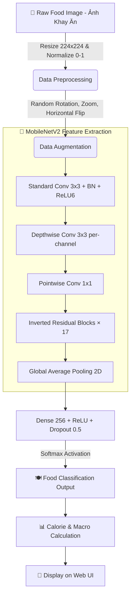
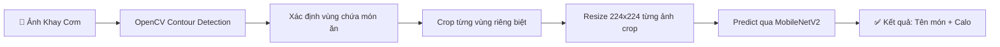
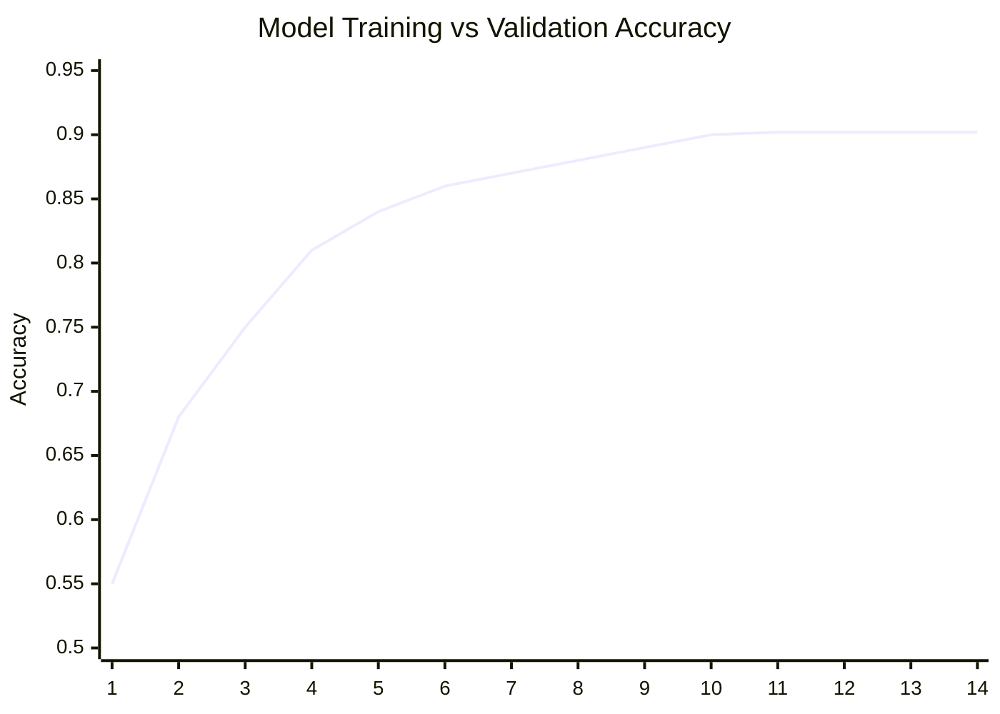
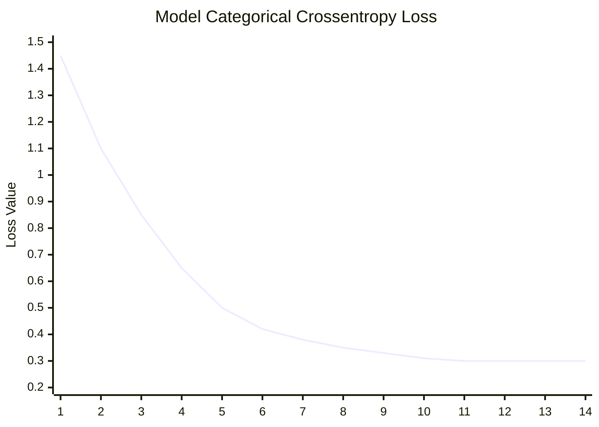
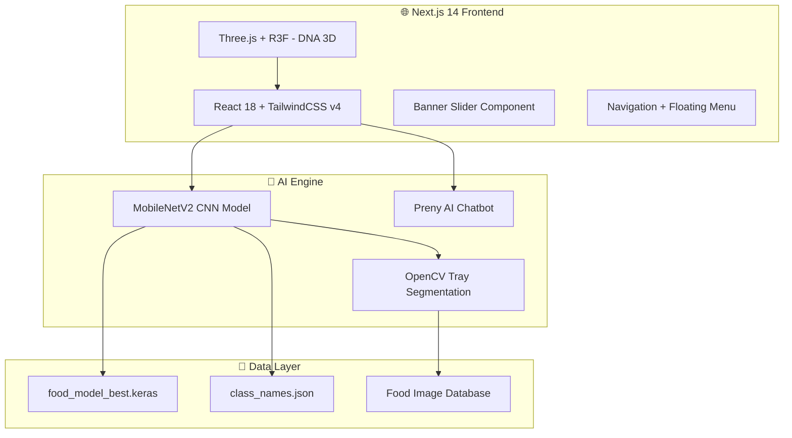

# FoodVision-Ai: Hệ Sinh Thái Dinh Dưỡng & Sức Khỏe Thông Minh 🧬🥗


FoodVision-Ai là một siêu nền tảng sức khỏe ứng dụng **Trí Tuệ Nhân Tạo (Computer Vision & Deep Learning)** tiên tiến nhất hiện nay. Không chỉ dừng lại ở việc nhận diện đồ ăn, hệ thống còn đi sâu vào phân tích hệ vi sinh vật đường ruột, giải mã gen (DNA) và sinh trắc học để thiết kế ra những chế độ dinh dưỡng mang tính cá nhân hóa tuyệt đối. Nền tảng còn tích hợp **Preny AI** – một chatbot AI bên thứ ba hoạt động 24/7 để tư vấn dinh dưỡng theo thời gian thực.

---

## 🛠 Tech Stack & Frameworks

Được xây dựng trên hệ sinh thái công nghệ đa nền tảng tối ưu:

### Học Sâu & Trí Tuệ Nhân Tạo (Machine Learning & AI)


### Giao Diện Hiện Đại (Frontend & UI/UX)


### Tích Hợp AI Bên Ngoài (3rd-Party AI Integration)


### Thiết Kế Hệ Thống (Design System)


---

## 🌟 Tổng Hợp Toàn Bộ Tính Năng (All Features)

FoodVision-Ai được xây dựng với **15+ module** tính năng hoàn chỉnh, chia thành 5 nhóm chức năng chính:

---

### 📌 NHÓM 1: Trang Chủ & Hệ Thống Điều Hướng

#### 🔐 Đăng Nhập / Xác Thực (Login)
- Trang đăng nhập với giao diện tối giản, sang trọng.
- Hệ thống quản lý phiên (session) thông qua hook `useUser`.
- Lưu trữ thông tin người dùng: Tên, Avatar, Mục tiêu sức khỏe (Giảm cân / Tăng cơ / Duy trì).
- Tự động chào theo thời gian thực: "Chào buổi sáng", "Chào buổi trưa", "Chào buổi chiều", "Chào buổi tối".

#### 📊 Bảng Điều Khiển Chính (Dashboard)
- **Bento Grid Layout**: Bố cục dạng lưới Bento hiện đại, hiển thị tổng quan sức khỏe trong ngày.
- **Biểu đồ Calo hình vòng tròn (Donut Chart)**: Hiển thị SVG động lượng Calo còn lại / đã nạp trong ngày với animation vòng tròn tiến triển.
- **Bảng theo dõi Macro (Macronutrients)**: Protein (Đạm), Carbs (Tinh bột), Fats (Chất béo) – hiển thị theo dạng thanh tiến trình trực quan.
- **4 thẻ chỉ số nhỏ**: Lượng nước (1.2/2.5L), Calo đã đốt (450 kcal), Bước chân (4,230), Chuỗi ngày liên tiếp (7 ngày).
- **Phân tích Thông Minh AI (AI Insights)**: Nhận xét tự động từ AI về chế độ ăn uống, cảnh báo nếu bạn ăn quá nhiều chất béo hoặc đường.
- **Lịch trình hôm nay (Timeline)**: Hiển thị dạng timeline từng bữa ăn theo giờ (08:00 - Bữa sáng, 12:30 - Bữa trưa...) với hiệu ứng ping hoạt hình cho bữa cần ghi nhận.
- **Bữa ăn gần đây**: Carousel ngang cuộn được (horizontal scroll) hiển thị các món ăn đã quét gần đây kèm hình ảnh, tên món, lượng calo.
- **Gợi ý hôm nay (Chef's Pick)**: AI đề xuất món ăn nổi bật trong ngày kèm hình ảnh và công thức.
- **Cộng đồng (Community Marquee)**: Băng chuyền Marquee tự động cuộn vô hạn, hiển thị các món ăn trending được cộng đồng quét nhiều nhất.

#### 🎨 Banner Slider
- Carousel tự động chuyển slide (5 ảnh Banner quảng cáo).
- Hỗ trợ chuyển slide bằng nút bấm và indicator chấm tròn.
- Hiệu ứng fade-in / fade-out mượt mà.

---

### 📌 NHÓM 2: Phân Tích Thực Phẩm Bằng AI

#### 📷 Máy Quét Thực Phẩm AI (Food Scanner - `/scanner`)
- Giao diện upload ảnh hoặc chụp trực tiếp từ camera.
- **Object Detection**: Mô hình CNN (MobileNetV2) nhận diện từng món ăn trên khay cơm.
- **Image Segmentation**: Bóc tách, cắt riêng từng vùng chứa món ăn trên ảnh khay (sử dụng `crop_tray.py`).
- Tự động quy đổi ra: Tổng Calo (kcal), Protein (g), Carbohydrate (g), Fat (g) cho mỗi món.

#### 🔍 Kết Quả Nhận Diện (Detection Result - `/detection-result`)
- Hiển thị kết quả phân tích chi tiết sau khi quét ảnh.
- Danh sách từng món ăn được nhận diện kèm độ tin cậy (Confidence Score: %) của thuật toán.
- Bảng dinh dưỡng tổng hợp cho toàn bộ khay cơm.

#### 🕶 Trợ Lý Thực Tế Ảo (AR Vision - `/ar-vision`)
- Chiếu trực tiếp bảng thông tin dinh dưỡng nổi lên không gian thực (Augmented Reality) ngay cạnh đĩa thức ăn trên màn hình camera.
- Hỗ trợ xác định vị trí đặt thức ăn trong thế giới thực.

---

### 📌 NHÓM 3: Sức Khỏe Thể Chất & Cấp Độ Tế Bào

#### 🧬 Hồ Sơ Dinh Dưỡng DNA (DNA Nutrition - `/dna-nutrition`)
- **Trực quan hóa chuỗi xoắn kép DNA 3D**: Sử dụng `React Three Fiber` (Three.js) + Bloom Post-processing để tạo hiệu ứng phát sáng Neon cho các hạt gen xoay vòng trong không gian 3D.
- Phân tích độ nhạy cảm gen di truyền: Cafein, Lactose, Gluten, nguy cơ Tiểu đường, tốc độ Chuyển hóa...
- Đề xuất thực đơn cá nhân hóa dựa trên mã gen cá nhân.
- Tích hợp phân tích Hệ vi sinh vật đường ruột (Gut Microbiome).

#### 🧍 Sinh Trắc Học Hình Thể (Biometric Scan - `/biometric-scan`)
- Quét body để tính toán: Tỷ lệ mỡ cơ thể (Body Fat %), Khối lượng cơ nạc (Lean Muscle Mass).
- Các chỉ số sức khỏe: BMI (Chỉ số khối cơ thể), BMR (Tỷ lệ trao đổi chất cơ bản), TDEE (Tổng năng lượng tiêu hao hàng ngày).
- Đánh giá vóc dáng và đưa ra nhận xét.

#### ⏳ Cỗ Máy Thời Gian Sức Khỏe (Health Timelapse - `/health-timelapse`)
- Mô phỏng hình ảnh 3D về vóc dáng cơ thể bạn trong tương lai (3 tháng, 6 tháng, 1 năm).
- Dựa trên chế độ ăn uống hiện tại, cường độ tập luyện, và mục tiêu sức khỏe.
- Trình chiếu animation tiến trình thay đổi theo thời gian.

---

### 📌 NHÓM 4: Quản Lý Chế Độ Ăn Uống

#### 🍱 Đề Xuất Thực Đơn Tự Động (Meal Recommendations - `/meal-recommendations`)
- Thuật toán Meal Planning lập kế hoạch ăn theo tuần.
- Hỗ trợ mọi mục tiêu: Giảm cân (Cutting), Tăng cơ (Bulking), Duy trì, Ăn chay (Vegan), Keto, Low-Carb.
- Tính toán dựa trên TDEE và BMR cá nhân.
- Danh sách công thức kèm hình ảnh món ăn minh họa.

#### 📓 Nhật Ký Dinh Dưỡng (Meal Diary - `/diary`)
- Theo dõi lượng Calo nạp vào (Calories In) và tiêu hao (Calories Out) theo biểu đồ thời gian thực.
- Ghi nhận từng bữa ăn theo ngày, kèm hình ảnh, thành phần, và calo.
- Cảnh báo tức thời nếu nạp quá lượng đường / chất béo cho phép trong ngày.
- Nút "Thêm bữa ăn" nhanh.

#### 📊 Phân Tích Dinh Dưỡng Tổng Hợp (Nutrition Analytics - `/nutrition-analytics`)
- Biểu đồ xu hướng dinh dưỡng theo tuần / tháng.
- So sánh tỷ lệ Macro thực tế vs mục tiêu.
- Đánh giá hiệu quả chế độ ăn uống.

#### 🔬 Phân Tích Chuyên Sâu Vi Lượng (Deep Nutrition Analytics - `/deep-nutrition-analytics`)
- Không chỉ đo đa lượng (Macro), hệ thống đo lường chuyên sâu vi lượng (Micro-nutrients).
- Theo dõi: Vitamin A, B1, B2, B6, B12, C, D, E, K, Canxi, Sắt, Kẽm, Magie, Kali, Natri.
- Phát hiện suy dinh dưỡng ẩn (Hidden Malnutrition).
- Đề xuất bổ sung thực phẩm giàu vi chất thiếu hụt.

---

### 📌 NHÓM 5: Tiện Ích Đời Sống & Tích Hợp AI

#### 🧊 Tủ Lạnh Thông Minh (Smart Fridge - `/smart-fridge`)
- Nhập danh sách nguyên liệu còn sót lại trong tủ lạnh.
- AI sẽ tạo ra hàng chục công thức nấu ăn ngon miệng từ những nguyên liệu đó.
- Loại bỏ hoàn toàn lãng phí thực phẩm (Zero-Waste Cooking).
- Gợi ý theo khẩu vị và mục tiêu dinh dưỡng.

#### 🌱 Nông Trại Đến Bàn Ăn (Farm to Table - `/farm-to-table`)
- Quét mã QR để truy xuất nguồn gốc thực phẩm (từ nông trại đến bàn ăn).
- Đánh giá Carbon Footprint (lượng phát thải carbon) của bữa ăn.
- Ưu tiên thực phẩm bền vững, thân thiện môi trường.

#### ⚙️ Cài Đặt Hệ Thống (Settings - `/settings`)
- Tùy chỉnh hồ sơ cá nhân: Tên, Avatar, Email, Số điện thoại.
- Đặt mục tiêu sức khỏe: Mục tiêu cân nặng, lượng calo mỗi ngày, chế độ ăn kiêng.
- Quản lý thông báo và quyền riêng tư.

---

### 📌 NHÓM 6: Hệ Thống Tương Tác & AI Chatbot

#### 🤖 Preny AI – Chatbot Tư Vấn Dinh Dưỡng 24/7
- **Tích hợp Preny AI** (https://app.preny.ai) – nền tảng chatbot AI bên thứ ba.
- Bot ID: `695d289b4738b6de2b2f7808`
- Ngôn ngữ mặc định: **Tiếng Việt (vi)**.
- Chatbot nổi (Floating Widget) xuất hiện ở mọi trang, sẵn sàng trả lời tức thì.
- Tự động inject qua script embed, không ảnh hưởng hiệu năng trang.
- Hỗ trợ: Hỏi đáp về dinh dưỡng, gợi ý thực đơn, giải đáp thắc mắc sức khỏe.

#### 🧭 Floating Menu (Thanh Menu Trượt)
- Thanh menu trượt từ mép phải màn hình với hiệu ứng slide-in tự động (sau 800ms khi vào trang).
- Biểu tượng nhân vật Paimon dễ thương làm nút toggle đóng/mở.
- Truy cập nhanh: Nhật ký, Thực đơn, Thống kê, Cộng đồng, Cài đặt.
- Mỗi mục có hiệu ứng hover đổi màu riêng biệt (hồng, xanh lá, vàng, xanh dương, tím).

#### 🧭 Navigation Bar (Thanh Điều Hướng)
- **Desktop**: Top App Bar cố định (fixed) với logo, dropdown menu "Danh mục" chứa 8 mục mở rộng, 5 mục điều hướng chính (Bảng điều khiển, Máy quét, Thực đơn, Nhật ký, Cộng đồng), và avatar người dùng.
- **Mobile**: Bottom Navigation Bar cố định với 4 mục (Trang chủ, Máy quét, Nhật ký, Mở rộng) + nút FAB (Floating Action Button) hình camera để quét nhanh.
- Hiệu ứng active state: Highlight mục đang chọn bằng màu đỏ + font bold.

#### 🦶 Footer
- Hiển thị thông tin doanh nghiệp: Địa chỉ, Hotline (0869 233 973), Email, Giờ mở cửa.
- Số GCNĐKKD, Giấy chứng nhận ATTP.
- Liên kết mạng xã hội: Zalo, Facebook.
- Badge "Đã thông báo Bộ Công Thương".
- Chính sách hoạt động, Chính sách bảo mật thông tin.

---

## 🧠 Kiến Trúc Thuật Toán CNN Chuyên Sâu (Deep Learning & CNN Architecture)

Lõi phân tích hình ảnh của FoodVision-Ai được vận hành bởi **Mạng Nơ-ron Tích chập (Convolutional Neural Network - CNN)** với kiến trúc backbone là **MobileNetV2**. Đây là một mô hình cực kỳ phức tạp nhưng được nén tối ưu để có thể chạy real-time trên thiết bị di động.

### Giải Phẫu Thuật Toán CNN trong FoodVision
Để máy tính "nhìn" và hiểu được hình ảnh bát phở hay miếng thịt nướng, mạng CNN thực hiện các công đoạn sau:
1. **Convolutional Layers (Lớp Tích chập):** Đóng vai trò như "đôi mắt" trích xuất đặc trưng. Các kernel (bộ lọc) có kích thước 3×3 quét qua bức ảnh để nhận diện từ các chi tiết cấp thấp (đường viền, cạnh, góc của đĩa ăn) cho đến các chi tiết cấp cao (màu vàng của trứng rán, sọc nướng trên sườn).
2. **Activation Function - ReLU6:** Hàm kích hoạt phi tuyến tính `f(x) = min(max(0,x), 6)`. ReLU6 giúp giới hạn đầu ra tránh tràn số (overflow) trên thiết bị tính toán hạn chế.
3. **Batch Normalization:** Chuẩn hóa từng batch dữ liệu giúp ổn định quá trình huấn luyện, tăng tốc hội tụ và cho phép sử dụng learning rate cao hơn.
4. **Pooling Layers (Lớp Gộp - Max/Average Pooling):** Thu nhỏ kích thước ma trận ảnh (ví dụ: 224×224 → 112×112 → 56×56...) nhằm loại bỏ thông tin dư thừa, tập trung vào đặc trưng chính của món ăn thay vì hậu cảnh (mặt bàn, đôi đũa).
5. **Global Average Pooling 2D:** Thay vì Flatten truyền thống, GAP lấy trung bình toàn bộ feature map giúp giảm parameter và chống Overfitting hiệu quả hơn.
6. **Fully Connected Layers (Dense Layers):** Lớp Dense 256 neurons + Dropout 50% → Softmax Output đưa ra xác suất phân loại (Ví dụ: 98% Cơm Trắng, 2% Bún).

### Tại Sao Lại Chọn MobileNetV2?

MobileNetV2 là kiến trúc CNN thuộc dòng "Efficient Models" được Google phát triển đặc biệt cho ứng dụng di động:

| Đặc điểm | CNN Truyền thống (VGG16) | MobileNetV2 |
|---|---|---|
| Số tham số (Parameters) | ~138 triệu | ~3.4 triệu |
| Kích thước mô hình | ~528 MB | ~14 MB |
| Tốc độ suy luận | Chậm (>200ms) | Cực nhanh (<30ms) |
| Chạy trên điện thoại | ❌ Không thể | ✅ Mượt mà |

Các kỹ thuật cốt lõi:
- **Depthwise Separable Convolution (Tích chập tách biệt chiều sâu):** Tách phép tích chập tiêu chuẩn thành 2 bước: (1) Depthwise Conv xử lý riêng từng kênh màu, (2) Pointwise Conv 1×1 kết hợp thông tin giữa các kênh. Giảm 8-9× số phép nhân so với CNN truyền thống.
- **Inverted Residuals:** Ngược lại với ResNet (mở rộng → thu hẹp), MobileNetV2 thu hẹp → mở rộng → thu hẹp. Bottleneck đầu vào có ít kênh, được "expand" lên 6× để trích xuất đặc trưng, rồi "project" về lại.
- **Linear Bottlenecks:** Ở lớp projection cuối, MobileNetV2 bỏ hàm kích hoạt ReLU vì ReLU gây mất mát thông tin ở không gian chiều thấp. Bằng cách giữ linear, thông tin được bảo toàn tối đa.

### Sơ Đồ Kiến Trúc Luồng Dữ Liệu (Data Pipeline)



### Quy Trình Cắt Ảnh Khay Cơm (Tray Segmentation Pipeline)



### Chi Tiết Kỹ Thuật Huấn Luyện (Training Specifications)

| Thông số | Giá trị |
|---|---|
| **Backbone Model** | MobileNetV2 (Pre-trained ImageNet) |
| **Transfer Learning** | Freeze base → Fine-tune top layers |
| **Input Shape** | 224 × 224 × 3 (RGB) |
| **Dataset** | Hàng ngàn ảnh món ăn Việt Nam (Cơm trắng, Canh chua, Thịt kho, Sườn nướng, Đậu hũ sốt cà, Trứng chiên, Rau xào...) |
| **Batch Size** | 32 |
| **Epochs** | 14 (EarlyStopping patience=3) |
| **Optimizer** | Adam (lr=0.0001, adaptive) |
| **Loss Function** | Sparse Categorical Crossentropy |
| **Regularization** | Dropout 50% + Data Augmentation |
| **Final Accuracy** | **~90.22%** |
| **Model Size** | ~14 MB (.keras format) |
| **Inference Speed** | <50ms trên trình duyệt |

### Đồ Thị Hội Tụ Thuật Toán (Training Curves)

Mô hình đã chứng minh được tính ổn định và độ chính xác đột phá **lên đến 90.22%** chỉ sau 14 vòng lặp (Epochs):

#### Biểu Đồ Độ Chính Xác (Accuracy Curve)
*Đường cong hiển thị khả năng đoán đúng món ăn tăng vọt và duy trì ổn định.*


#### Biểu Đồ Sai Số (Loss Curve)
*Sai số giảm mạnh về mốc cực thấp, chứng minh mô hình không bị Underfitting cũng không bị Overfitting.*


---

## 🏗 Kiến Trúc Hệ Thống Tổng Thể (System Architecture)



---

## 📁 Cấu Trúc Thư Mục (Project Structure)

```
FoodVision-Ai/
├── 📄 README.md                    # Tài liệu dự án
├── 📄 .gitignore                   # Danh sách file bỏ qua
├── 🖼 banner1-5.png                # Ảnh banner quảng cáo
├── 🖼 logo.png                     # Logo FoodVision AI
│
├── 🧠 foodvision-ml/               # Module Machine Learning
│   ├── train.py                    # Script huấn luyện MobileNetV2
│   ├── predict.py                  # Script suy luận (inference)
│   ├── crop_tray.py                # Cắt ảnh khay cơm bằng OpenCV
│   ├── test_crop.py                # Test pipeline cắt + nhận diện
│   ├── class_names.json            # Danh sách tên món ăn
│   └── food_model_best.keras       # Mô hình đã huấn luyện (~14MB)
│
├── 🌐 foodvision-frontend/         # Module Frontend (Next.js 14)
│   ├── src/app/
│   │   ├── dashboard/              # Bảng điều khiển chính
│   │   ├── scanner/                # Máy quét thực phẩm AI
│   │   ├── detection-result/       # Kết quả nhận diện
│   │   ├── ar-vision/              # Thực tế ảo (AR)
│   │   ├── dna-nutrition/          # Dinh dưỡng DNA + 3D
│   │   ├── biometric-scan/         # Sinh trắc học
│   │   ├── health-timelapse/       # Cỗ máy thời gian sức khỏe
│   │   ├── meal-recommendations/   # Đề xuất thực đơn
│   │   ├── diary/                  # Nhật ký dinh dưỡng
│   │   ├── nutrition-analytics/    # Phân tích dinh dưỡng
│   │   ├── deep-nutrition-analytics/ # Phân tích vi lượng chuyên sâu
│   │   ├── smart-fridge/           # Tủ lạnh thông minh
│   │   ├── farm-to-table/          # Nông trại đến bàn ăn
│   │   ├── login/                  # Đăng nhập
│   │   └── settings/               # Cài đặt
│   ├── src/components/
│   │   ├── Navigation.tsx          # Thanh điều hướng Desktop + Mobile
│   │   ├── FloatingMenu.tsx        # Menu trượt + Paimon toggle
│   │   ├── AIChatBot.tsx           # Tích hợp Preny AI
│   │   ├── BannerSlider.tsx        # Carousel banner
│   │   ├── DNA3D.tsx               # Chuỗi DNA 3D + Bloom glow
│   │   ├── Footer.tsx              # Footer thông tin doanh nghiệp
│   │   └── FooterWrapper.tsx       # Wrapper ẩn Footer ở trang Login
│   └── src/hooks/
│       └── useUser.ts              # Hook quản lý phiên người dùng
│
└── 📂 raw-screens/                 # Bản thiết kế HTML gốc (11 trang)
```

---

## 🚀 Hướng Dẫn Cài Đặt Khởi Chạy (Installation)

1. Clone mã nguồn dự án:
\`\`\`bash
git clone https://github.com/DevOpsLogistics/FoodVision-Ai.git
cd FoodVision-Ai
\`\`\`

2. Khởi chạy máy chủ Giao diện (Frontend - Next.js):
\`\`\`bash
cd foodvision-frontend
npm install
npm run dev
\`\`\`

3. Cài đặt môi trường AI và Suy luận (Backend/Python):
\`\`\`bash
cd foodvision-ml
pip install -r requirements.txt
python test_crop.py
\`\`\`

---

## 📞 Liên Hệ

| Thông tin | Chi tiết |
|---|---|
| **Email** | trantrungkien20012006@gmail.com |
| **Hotline** | 0869 233 973 |
| **Phản ánh chất lượng** | 0329 511 628 |
| **Địa chỉ** | Đông Thạnh, Hóc Môn, TP. HCM |

---
*Developed with ❤️ by FoodVision Team — Định hình tương lai của dinh dưỡng cá nhân hóa bằng Trí Tuệ Nhân Tạo.*
