# FoodVision-Ai: Hệ Sinh Thái Dinh Dưỡng & Sức Khỏe Thông Minh


FoodVision-Ai là một siêu nền tảng sức khỏe ứng dụng **Trí Tuệ Nhân Tạo (Computer Vision & Deep Learning)** tiên tiến nhất hiện nay. Không chỉ dừng lại ở việc nhận diện đồ ăn, hệ thống còn đi sâu vào phân tích hệ vi sinh vật đường ruột, giải mã gen (DNA) và sinh trắc học để thiết kế ra những chế độ dinh dưỡng mang tính cá nhân hóa tuyệt đối. Nền tảng còn tích hợp **Preny AI** – một chatbot AI bên thứ ba hoạt động 24/7 để tư vấn dinh dưỡng theo thời gian thực.

---

## Tech Stack & Frameworks

### Học Sâu & Trí Tuệ Nhân Tạo (Machine Learning & AI)


### Giao Diện Hiện Đại (Frontend & UI/UX)


### Tích Hợp AI Bên Ngoài (3rd-Party AI Integration)


### Thiết Kế Hệ Thống (Design System)


---

## Tổng Hợp Toàn Bộ Tính Năng (All Features)

FoodVision-Ai được xây dựng với **15+ module** tính năng hoàn chỉnh:

---

### NHÓM 1: Trang Chủ & Bảng Điều Khiển

#### Đăng Nhập / Xác Thực (Login)
- Trang đăng nhập với giao diện tối giản, sang trọng.
- Hệ thống quản lý phiên (session) người dùng.
- Lưu trữ thông tin: Tên, Avatar, Mục tiêu sức khỏe (Giảm cân / Tăng cơ / Duy trì).
- Tự động chào theo thời gian thực trong ngày.

#### Bảng Điều Khiển Chính (Dashboard)
- Bố cục dạng lưới Bento hiện đại, hiển thị tổng quan sức khỏe trong ngày.
- Biểu đồ Calo hình vòng tròn (Donut Chart) với animation SVG.
- Bảng theo dõi Macronutrients: Protein, Carbs, Fats.
- Các thẻ chỉ số: Lượng nước, Calo đã đốt, Bước chân, Chuỗi ngày.
- Phân tích Thông Minh AI: Nhận xét tự động từ AI về chế độ ăn uống.
- Lịch trình bữa ăn trong ngày dạng Timeline.
- Carousel bữa ăn gần đây và gợi ý món ăn từ AI.
- Bảng xếp hạng cộng đồng: Hiển thị các món ăn trending.

#### Banner Slider
- Carousel tự động chuyển slide với 5 ảnh Banner.

---

### NHÓM 2: Phân Tích Thực Phẩm Bằng AI

#### Máy Quét Thực Phẩm AI (Food Scanner)
- Upload ảnh hoặc chụp trực tiếp từ camera.
- **Object Detection**: Mô hình CNN (MobileNetV2) nhận diện từng món ăn trên khay cơm.
- **Image Segmentation**: Bóc tách, cắt riêng từng vùng chứa món ăn trên ảnh khay.
- Tự động quy đổi ra: Tổng Calo (kcal), Protein (g), Carbohydrate (g), Fat (g).

#### Kết Quả Nhận Diện (Detection Result)
- Hiển thị kết quả phân tích chi tiết sau khi quét ảnh.
- Danh sách từng món ăn kèm độ tin cậy (Confidence Score %).
- Bảng dinh dưỡng tổng hợp cho toàn bộ khay cơm.

#### Trợ Lý Thực Tế Ảo (AR Vision)
- Chiếu bảng thông tin dinh dưỡng lên không gian thực (Augmented Reality).
- Xác định vị trí đặt thức ăn trong thế giới thực.

---

### NHÓM 3: Sức Khỏe Thể Chất & Cấp Độ Tế Bào

#### Hồ Sơ Dinh Dưỡng DNA (DNA Nutrition)
- Trực quan hóa chuỗi xoắn kép DNA 3D bằng React Three Fiber + Bloom Post-processing.
- Phân tích độ nhạy cảm gen di truyền: Cafein, Lactose, Gluten, nguy cơ Tiểu đường, tốc độ Chuyển hóa.
- Đề xuất thực đơn cá nhân hóa dựa trên mã gen.
- Tích hợp phân tích Hệ vi sinh vật đường ruột (Gut Microbiome).

#### Sinh Trắc Học Hình Thể (Biometric Scan)
- Tính toán: Tỷ lệ mỡ cơ thể (Body Fat %), Khối lượng cơ nạc (Lean Muscle Mass).
- Các chỉ số: BMI, BMR, TDEE.
- Đánh giá vóc dáng và đưa ra nhận xét.

#### Cỗ Máy Thời Gian Sức Khỏe (Health Timelapse)
- Mô phỏng hình ảnh 3D về vóc dáng cơ thể trong tương lai (3 tháng, 6 tháng, 1 năm).
- Dựa trên chế độ ăn uống, cường độ tập luyện, và mục tiêu sức khỏe.

---

### NHÓM 4: Quản Lý Chế Độ Ăn Uống

#### Đề Xuất Thực Đơn Tự Động (Meal Recommendations)
- Thuật toán Meal Planning lập kế hoạch ăn theo tuần.
- Hỗ trợ mọi mục tiêu: Giảm cân, Tăng cơ, Duy trì, Ăn chay, Keto, Low-Carb.
- Tính toán dựa trên TDEE và BMR cá nhân.

#### Nhật Ký Dinh Dưỡng (Meal Diary)
- Theo dõi lượng Calo nạp vào và tiêu hao theo biểu đồ thời gian thực.
- Ghi nhận từng bữa ăn theo ngày kèm hình ảnh, thành phần, và calo.
- Cảnh báo tức thời nếu vượt ngưỡng cho phép.

#### Phân Tích Dinh Dưỡng Tổng Hợp (Nutrition Analytics)
- Biểu đồ xu hướng dinh dưỡng theo tuần / tháng.
- So sánh tỷ lệ Macro thực tế vs mục tiêu.

#### Phân Tích Chuyên Sâu Vi Lượng (Deep Nutrition Analytics)
- Đo lường vi lượng (Micro-nutrients): Vitamin A, B, C, D, E, K, Canxi, Sắt, Kẽm, Magie.
- Phát hiện suy dinh dưỡng ẩn (Hidden Malnutrition).
- Đề xuất bổ sung thực phẩm giàu vi chất thiếu hụt.

---

### NHÓM 5: Tiện Ích Đời Sống

#### Tủ Lạnh Thông Minh (Smart Fridge)
- Nhập danh sách nguyên liệu còn dư trong tủ lạnh.
- AI tạo ra các công thức nấu ăn từ những nguyên liệu đó.
- Loại bỏ lãng phí thực phẩm (Zero-Waste Cooking).

#### Nông Trại Đến Bàn Ăn (Farm to Table)
- Quét mã QR để truy xuất nguồn gốc thực phẩm.
- Đánh giá Carbon Footprint của bữa ăn.

#### Cài Đặt Hệ Thống (Settings)
- Tùy chỉnh hồ sơ cá nhân: Tên, Avatar, Email, Số điện thoại.
- Đặt mục tiêu sức khỏe và chế độ ăn kiêng.

---

### NHÓM 6: Tích Hợp AI Chatbot

#### Preny AI - Chatbot Tư Vấn Dinh Dưỡng 24/7
- Tích hợp **Preny AI** (https://app.preny.ai) - nền tảng chatbot AI bên thứ ba.
- Ngôn ngữ mặc định: Tiếng Việt.
- Chatbot nổi (Floating Widget) xuất hiện ở mọi trang, sẵn sàng trả lời tức thì.
- Hỗ trợ: Hỏi đáp về dinh dưỡng, gợi ý thực đơn, giải đáp thắc mắc sức khỏe.

---

## Kiến Trúc Thuật Toán CNN Chuyên Sâu (Deep Learning & CNN Architecture)

Lõi phân tích hình ảnh của FoodVision-Ai được vận hành bởi **Mạng Nơ-ron Tích chập (Convolutional Neural Network - CNN)** với kiến trúc backbone là **MobileNetV2**.

### Giải Phẫu Thuật Toán CNN trong FoodVision

Để máy tính "nhìn" và hiểu được hình ảnh bát phở hay miếng thịt nướng, mạng CNN thực hiện các công đoạn sau:

1. **Convolutional Layers (Lớp Tích chập):** Đóng vai trò trích xuất đặc trưng. Các kernel (bộ lọc) có kích thước 3x3 quét qua bức ảnh để nhận diện từ các chi tiết cấp thấp (đường viền, cạnh) cho đến chi tiết cấp cao (màu sắc, hình dạng món ăn).
2. **Activation Function - ReLU6:** Hàm kích hoạt phi tuyến tính `f(x) = min(max(0,x), 6)`. ReLU6 giúp giới hạn đầu ra tránh tràn số trên thiết bị tính toán hạn chế.
3. **Batch Normalization:** Chuẩn hóa từng batch dữ liệu giúp ổn định quá trình huấn luyện và tăng tốc hội tụ.
4. **Pooling Layers (Lớp Gộp):** Thu nhỏ kích thước ma trận ảnh (224x224 -> 112x112 -> 56x56...) nhằm loại bỏ thông tin dư thừa, tập trung vào đặc trưng chính của món ăn.
5. **Global Average Pooling 2D:** Thay vì Flatten truyền thống, GAP lấy trung bình toàn bộ feature map giúp giảm parameter và chống Overfitting.
6. **Fully Connected Layers (Dense Layers):** Lớp Dense 256 neurons + Dropout 50% -> Softmax Output đưa ra xác suất phân loại.

### Sơ Đồ Kiến Trúc Tổng Quan CNN

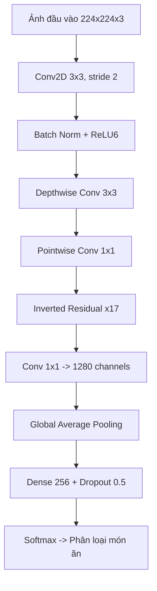

### Kỹ Thuật Depthwise Separable Convolution

Đây là kỹ thuật cốt lõi giúp MobileNetV2 nhẹ hơn 8-9 lần so với CNN truyền thống. Thay vì dùng một bộ lọc lớn, kỹ thuật này tách thành 2 bước:

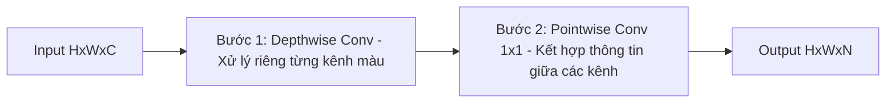

**So sánh số phép tính:**

| Phương pháp | Công thức | Ví dụ (K=3, C=32, N=64) |
|---|---|---|
| Conv truyền thống | H x W x K x K x C x N | 36,864 phép nhân/pixel |
| Depthwise Separable | H x W x (K x K x C + C x N) | 2,336 phép nhân/pixel |
| **Giảm** | | **~15.8 lần** |

### Cấu Trúc Inverted Residual Block

MobileNetV2 sử dụng cấu trúc Inverted Residual - ngược lại với ResNet truyền thống:

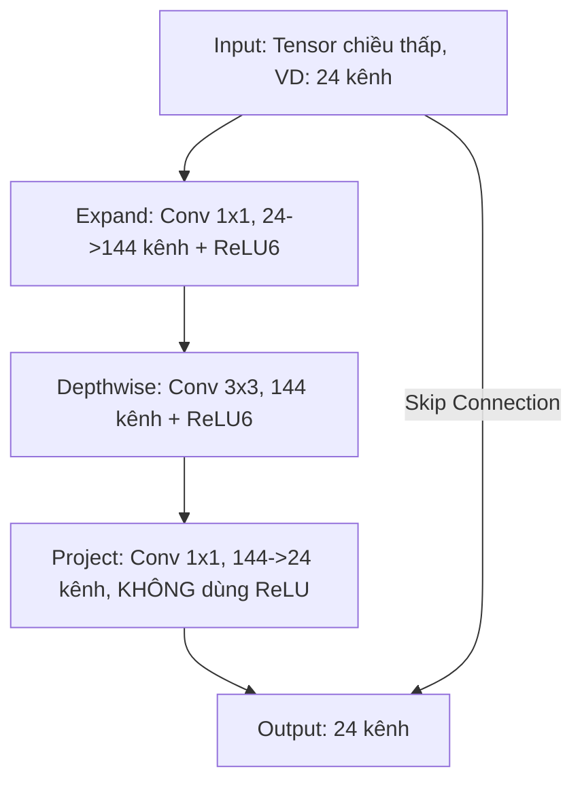

**Tại sao bỏ ReLU ở lớp Project?** Vì ReLU gây mất mát thông tin ở không gian chiều thấp (Linear Bottleneck). Bằng cách giữ linear, thông tin được bảo toàn tối đa.

### Tại Sao Lại Chọn MobileNetV2?

| Đặc điểm | CNN Truyền thống (VGG16) | MobileNetV2 |
|---|---|---|
| Số tham số (Parameters) | ~138 triệu | ~3.4 triệu |
| Kích thước mô hình | ~528 MB | ~14 MB |
| FLOPs (Phép tính) | ~15.5 tỉ | ~0.3 tỉ |
| Tốc độ suy luận | Chậm (>200ms) | Cực nhanh (<30ms) |
| Chạy trên điện thoại | Không thể | Mượt mà |
| Độ chính xác ImageNet | 71.3% | 72.0% |

### Luồng Dữ Liệu Từ Ảnh Đến Kết Quả (Data Pipeline)

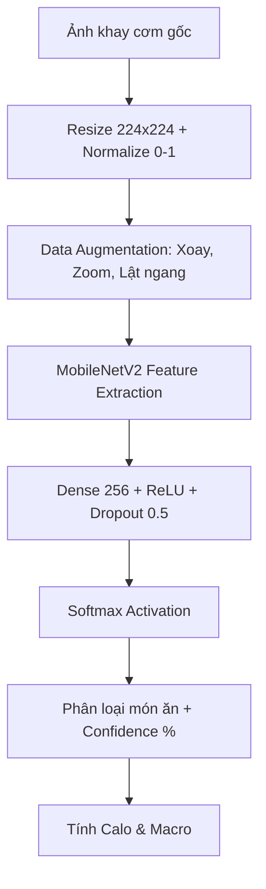

### Quy Trình Cắt Ảnh Khay Cơm (Tray Segmentation)

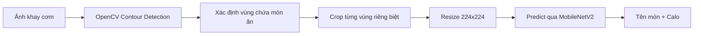

### Quy Trình Transfer Learning

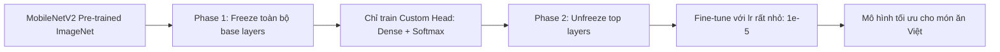

### Chi Tiết Kỹ Thuật Huấn Luyện

| Thông số | Giá trị |
|---|---|
| **Backbone Model** | MobileNetV2 (Pre-trained ImageNet) |
| **Transfer Learning** | Freeze base -> Fine-tune top layers |
| **Input Shape** | 224 x 224 x 3 (RGB) |
| **Dataset** | Hàng ngàn ảnh món ăn Việt Nam |
| **Batch Size** | 32 |
| **Epochs** | 14 (EarlyStopping patience=3) |
| **Optimizer** | Adam (lr=0.0001, adaptive) |
| **Loss Function** | Sparse Categorical Crossentropy |
| **Regularization** | Dropout 50% + Data Augmentation |
| **Final Accuracy** | **~90.22%** |
| **Model Size** | ~14 MB (.keras format) |
| **Inference Speed** | <50ms trên trình duyệt |

### Đồ Thị Hội Tụ Thuật Toán (Training Curves)

Mô hình đạt độ chính xác **~90.22%** sau 14 Epochs:

#### Biểu Đồ Độ Chính Xác (Accuracy)

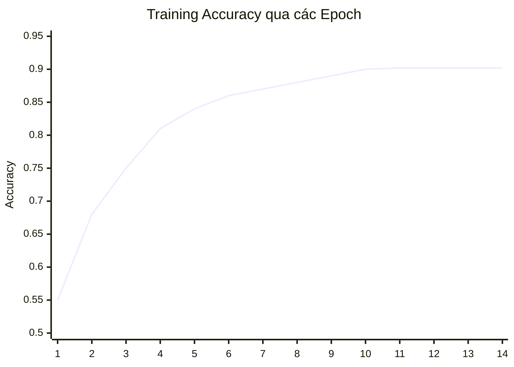

#### Biểu Đồ Sai Số (Loss)

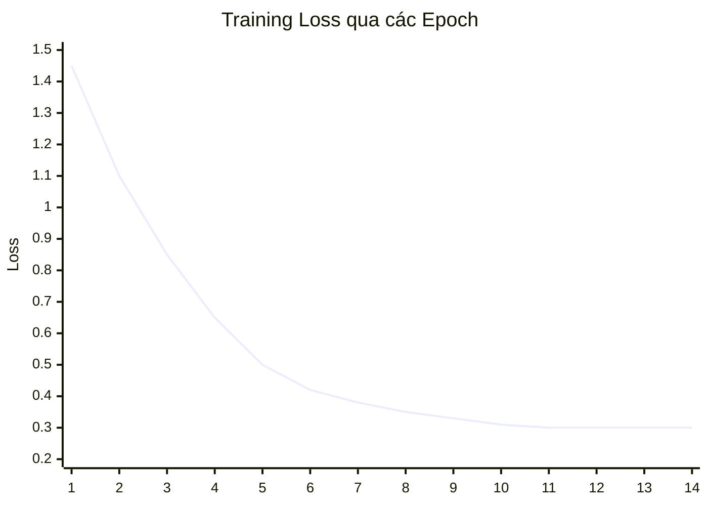

#### So Sánh Hiệu Năng Với Các Mô Hình Khác

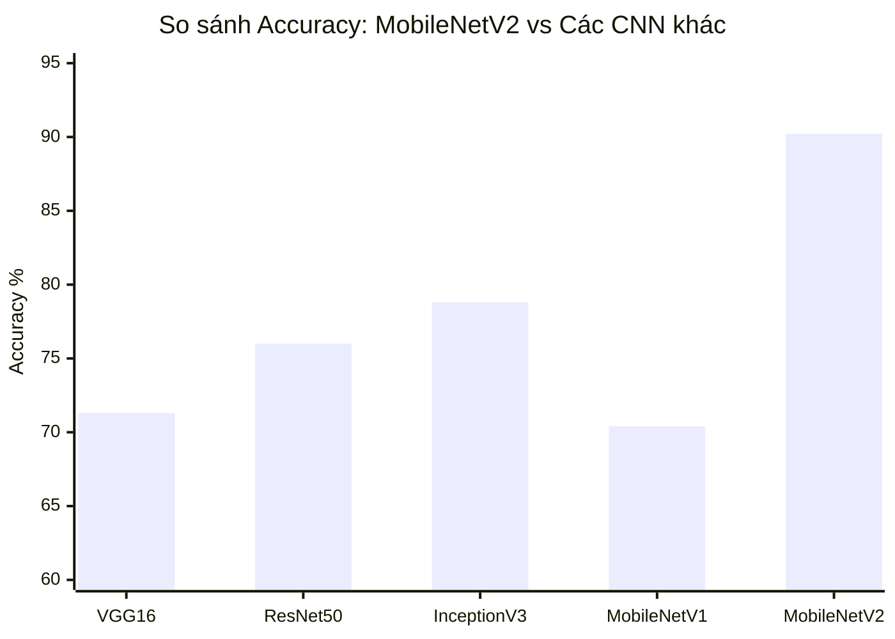

#### Phân Bố Dữ Liệu Huấn Luyện

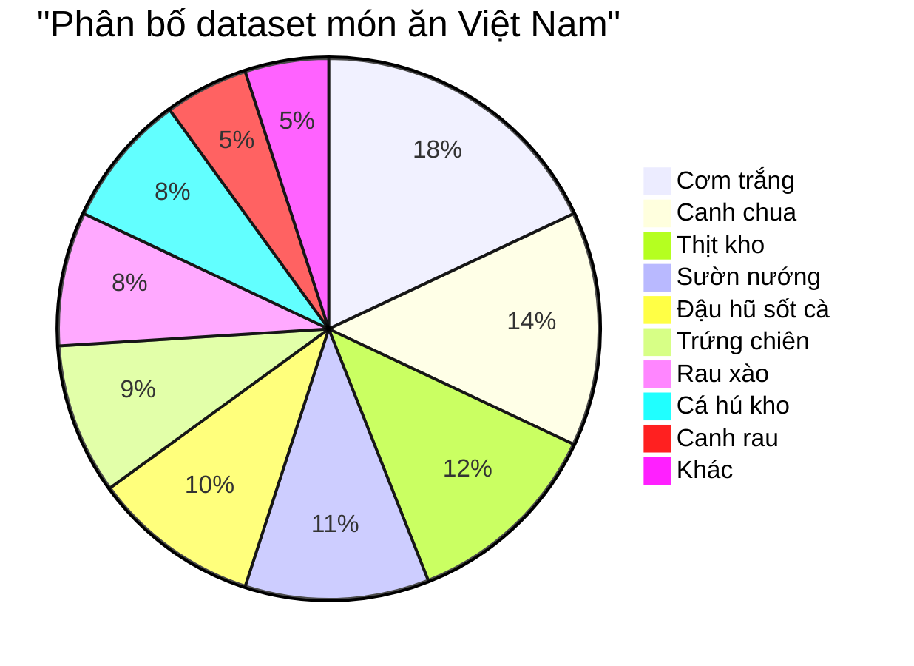

---

## Kiến Trúc Hệ Thống Tổng Thể

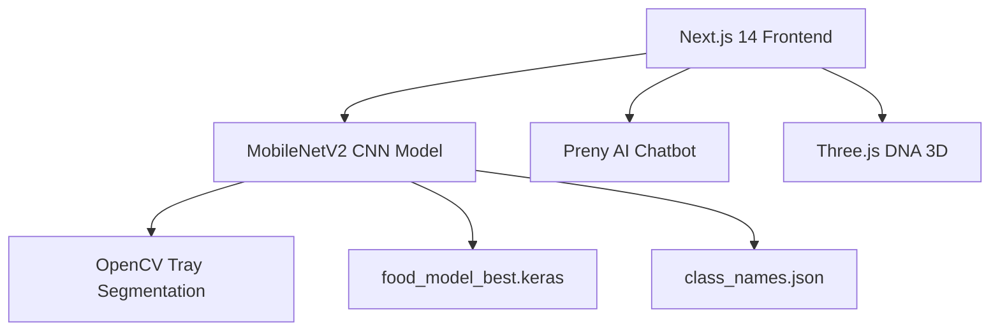

---

## Cấu Trúc Thư Mục (Project Structure)

```
FoodVision-Ai/
|-- README.md
|-- .gitignore
|-- banner1-5.png
|-- logo.png
|
|-- foodvision-ml/
|   |-- train.py                      # Script huấn luyện MobileNetV2
|   |-- predict.py                    # Script suy luận (inference)
|   |-- crop_tray.py                  # Cắt ảnh khay cơm bằng OpenCV
|   |-- test_crop.py                  # Test pipeline cắt + nhận diện
|   |-- class_names.json              # Danh sách tên món ăn
|   +-- food_model_best.keras         # Mô hình đã huấn luyện (~14MB)
|
|-- foodvision-frontend/
|   |-- src/app/
|   |   |-- dashboard/                # Bảng điều khiển chính
|   |   |-- scanner/                  # Máy quét thực phẩm AI
|   |   |-- detection-result/         # Kết quả nhận diện
|   |   |-- ar-vision/                # Thực tế ảo (AR)
|   |   |-- dna-nutrition/            # Dinh dưỡng DNA + 3D
|   |   |-- biometric-scan/           # Sinh trắc học
|   |   |-- health-timelapse/         # Cỗ máy thời gian sức khỏe
|   |   |-- meal-recommendations/     # Đề xuất thực đơn
|   |   |-- diary/                    # Nhật ký dinh dưỡng
|   |   |-- nutrition-analytics/      # Phân tích dinh dưỡng
|   |   |-- deep-nutrition-analytics/ # Phân tích vi lượng chuyên sâu
|   |   |-- smart-fridge/             # Tủ lạnh thông minh
|   |   |-- farm-to-table/            # Nông trại đến bàn ăn
|   |   |-- login/                    # Đăng nhập
|   |   +-- settings/                 # Cài đặt
|   |-- src/components/
|   |   |-- Navigation.tsx            # Thanh điều hướng
|   |   |-- FloatingMenu.tsx          # Menu truy cập nhanh
|   |   |-- AIChatBot.tsx             # Tích hợp Preny AI
|   |   |-- BannerSlider.tsx          # Carousel banner
|   |   |-- DNA3D.tsx                 # Chuỗi DNA 3D
|   |   |-- Footer.tsx                # Footer
|   |   +-- FooterWrapper.tsx         # Wrapper Footer
|   +-- src/hooks/
|       +-- useUser.ts                # Hook quản lý phiên người dùng
|
+-- raw-screens/                      # Bản thiết kế HTML gốc (11 trang)
```

---

## Hướng Dẫn Cài Đặt (Installation)

1. Clone mã nguồn dự án:
\`\`\`bash
git clone https://github.com/DevOpsLogistics/FoodVision-Ai.git
cd FoodVision-Ai
\`\`\`

2. Khởi chạy Frontend (Next.js):
\`\`\`bash
cd foodvision-frontend
npm install
npm run dev
\`\`\`

3. Cài đặt môi trường AI (Python):
\`\`\`bash
cd foodvision-ml
pip install -r requirements.txt
python test_crop.py
\`\`\`

---

## Liên Hệ

| Thông tin | Chi tiết |
|---|---|
| **Email** | trantrungkien20012006@gmail.com |
| **Hotline** | 0869 233 973 |
| **Phản ánh chất lượng** | 0329 511 628 |
| **Địa chỉ** | Đông Thạnh, Hóc Môn, TP. HCM |

---
*Developed by FoodVision Team - Định hình tương lai của dinh dưỡng cá nhân hóa bằng Trí Tuệ Nhân Tạo.*
