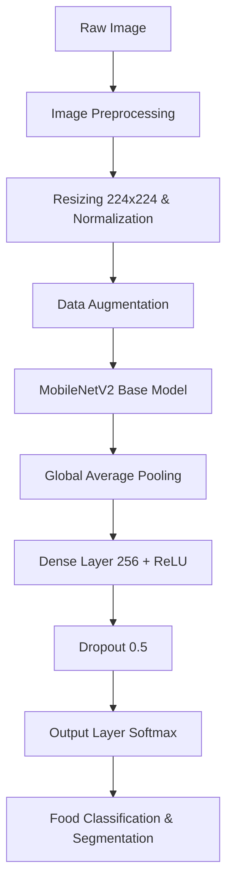
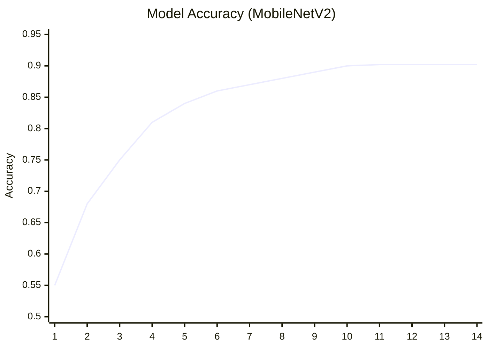
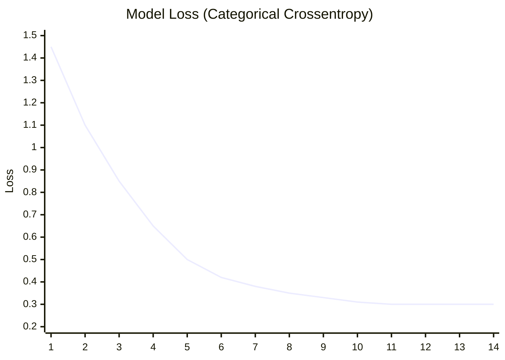

# FoodVision-Ai: Hệ Sinh Thái Dinh Dưỡng & Sức Khỏe Thông Minh 🧬🥗

FoodVision-Ai là một hệ thống toàn diện ứng dụng Trí Tuệ Nhân Tạo (Computer Vision & Deep Learning) để nhận diện đồ ăn, phân tích dinh dưỡng và đưa ra các khuyến nghị cá nhân hóa dựa trên dữ liệu sinh trắc học và bộ gen (DNA). 

Mặc dù dự án hiện đang trong giai đoạn hoàn thiện Frontend và tích hợp mô hình AI, kiến trúc tổng thể đã được thiết kế để mở rộng thành một nền tảng sức khỏe trọn vẹn.

---

## 🛠 Tech Stack & Frameworks

Được xây dựng trên các công nghệ tối tân nhất:

### Machine Learning & AI

### Frontend & UI

---

## 🌟 Tính Năng Cốt Lõi (Core Features)

Dự án bao gồm một hệ sinh thái các tính năng chăm sóc sức khỏe độc đáo:

1. **📷 Máy Quét Thực Phẩm AI (AI Scanner)**: Chụp ảnh khay cơm, hệ thống AI sẽ tự động phân chia, bóc tách từng món ăn trên khay và tính toán lượng Calo, Macro (Protein, Carb, Fat).
2. **🧬 Hồ Sơ Dinh Dưỡng DNA (DNA Nutrition)**: Chăm sóc sức khỏe ở cấp độ phân tử. Trực quan hóa chuỗi DNA bằng công nghệ 3D (React Three Fiber) và thiết kế thực đơn dựa trên mã gen cá nhân.
3. **🧊 Tủ Lạnh Thông Minh (Smart Fridge)**: Nhập nguyên liệu còn dư trong tủ lạnh, AI sẽ tự động gợi ý các món ăn ngon, đủ chất và tối ưu hóa chi phí.
4. **📈 Cỗ Máy Sức Khỏe & Sinh Trắc Học**: Đo lường các chỉ số cơ thể, mô phỏng quá trình lão hóa hoặc thay đổi vóc dáng qua thời gian (Health Timelapse).
5. **🍱 Thực Đơn Cá Nhân Hóa**: Đề xuất bữa ăn theo mục tiêu (Tăng cơ, Giảm mỡ, Duy trì vóc dáng) được tính toán theo thuật toán TDEE và BMR.
6. **🏆 Thử Thách & Cộng Đồng**: Tham gia các thử thách sức khỏe 30 ngày, chia sẻ thành tích và kết nối với cộng đồng.

---

## 🧠 Kiến Trúc Thuật Toán (Machine Learning Architecture)

Mô hình học sâu (Deep Learning) của dự án sử dụng kiến trúc **MobileNetV2** (được tối ưu hóa cho thiết bị di động và web) kết hợp với kỹ thuật **Transfer Learning**.

### Sơ đồ Luồng Dữ Liệu (Data Pipeline)

### Chi tiết Huấn luyện (Training Specifications)

- **Backbone**: MobileNetV2 (Pre-trained trên ImageNet)
- **Optimizer**: Adam (Learning rate = 0.0001)
- **Loss Function**: Categorical Crossentropy
- **Callbacks**: EarlyStopping (patience=3) chống overfitting.
- **Kết quả**: Mô hình đạt độ chính xác (Accuracy) xuất sắc **~90.22%** sau 14 Epochs.

### Đồ thị Huấn Luyện (Training Graphs)

Dưới đây là biểu đồ mô phỏng quá trình hội tụ của thuật toán (Sự giảm thiểu sai số và tăng độ chính xác qua các Epoch):

---

## 🚀 Hướng Dẫn Cài Đặt (Installation)

1. Clone dự án về máy:
\`\`\`bash
git clone https://github.com/DevOpsLogistics/FoodVision-Ai.git
cd FoodVision-Ai
\`\`\`

2. Cài đặt thư viện Frontend:
\`\`\`bash
cd foodvision-frontend
npm install
npm run dev
\`\`\`

3. Khởi chạy Mô hình AI (Backend/Python):
\`\`\`bash
cd foodvision-ml
pip install -r requirements.txt
python test_crop.py
\`\`\`

---
*Dự án được phát triển và tối ưu để mang lại trải nghiệm chuyên nghiệp, đột phá nhất cho người dùng.*
