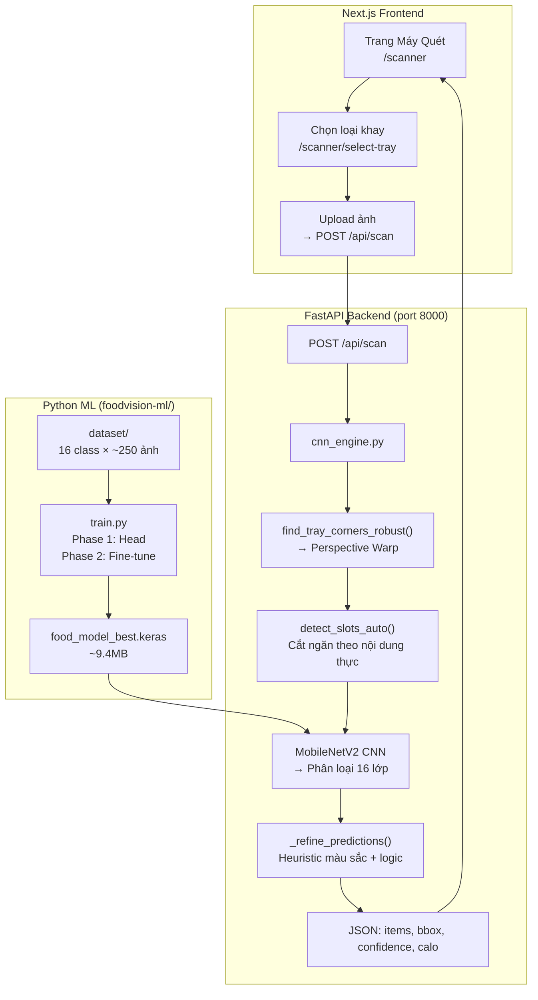
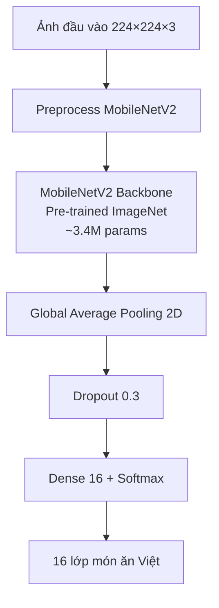
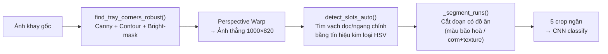
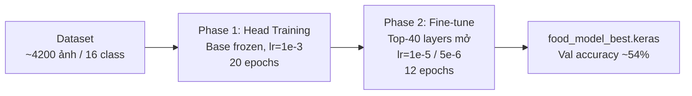

# FoodVision-Ai: Nhận Diện Món Ăn Khay Trường Bằng Deep Learning


FoodVision-Ai là hệ thống nhận diện món ăn trên khay cơm trường học (inox) bằng **Computer Vision + CNN (MobileNetV2)**. Hệ thống tự động phát hiện từng ngăn, nhận diện 16 món ăn phổ biến, tính calo và hiển thị kết quả trực tiếp trên web.

---

## Tech Stack

| Layer | Công nghệ |
|-------|-----------|
| **ML/CV** | TensorFlow 2.15, Keras 3, MobileNetV2, OpenCV |
| **API** | FastAPI, Python 3.11, Uvicorn |
| **Frontend** | Next.js 14, React 18, TailwindCSS v4 |
| **Chatbot** | Preny AI (tích hợp iframe) |

---

## Kiến Trúc Hệ Thống



---

## Tính Năng Chính

### Máy Quét Khay Cơm AI (Core Feature)

- **Chọn loại khay**: 4 layout được hỗ trợ
- **Perspective Warp**: tự chỉnh thẳng ảnh chụp nghiêng
- **Auto-detect ngăn** (`warp-auto`): phát hiện vị trí từng ngăn theo nội dung thật (màu sắc + texture), không cần template cố định
- **CNN classify**: nhận diện 16 lớp món ăn Việt Nam
- **Color heuristics**: kiểm tra lại kết quả CNN bằng màu sắc (canh, cơm, rau)
- **Hiển thị kết quả**: bounding box + tên món + % confidence + calo/macro

### 4 Layout Khay Được Hỗ Trợ

| ID | Tên | Mô tả |
|----|-----|-------|
| `school-v` | Khay V trường học | 2 ngăn trái lớn + 3 ngăn phải |
| `tray-32` | Khay 3+2 dọc | 3 ngăn trái + 2 ngăn phải |
| `tray-23` | Khay 2+3 ngang | 2 ngăn trên + 3 ngăn dưới |
| `tray-32u` | Khay 3+2 ngang | 3 ngăn trên + 2 ngăn dưới |

### 16 Lớp Món Ăn Được Nhận Diện

| STT | Class | Tên tiếng Việt |
|-----|-------|----------------|
| 0 | `ca_hu_kho` | Cá hú kho |
| 1 | `ca_kho` | Cá kho |
| 2 | `canh_chua_co_ca` | Canh chua có cá |
| 3 | `canh_chua_khong_ca` | Canh chua không cá |
| 4 | `canh_rau` | Canh rau |
| 5 | `com_trang` | Cơm trắng |
| 6 | `dau_hu_chien` | Đậu hũ chiên |
| 7 | `dau_hu_sot_ca` | Đậu hũ sốt cà |
| 8 | `kim_chi` | Kim chi |
| 9 | `mam_vung` | Mắm vừng lạc |
| 10 | `rau_luoc` | Rau luộc |
| 11 | `rau_xao` | Rau xào |
| 12 | `suon_nuong` | Sườn nướng |
| 13 | `thit_kho` | Thịt kho |
| 14 | `thit_kho_trung` | Thịt kho trứng |
| 15 | `trung_chien` | Trứng chiên |

### Các Trang Web

| Trang | Mô tả |
|-------|-------|
| `/` | Trang chủ |
| `/dashboard` | Bảng điều khiển dinh dưỡng |
| `/scanner/select-tray` | Chọn loại khay trước khi quét |
| `/scanner` | Upload & quét ảnh khay cơm |
| `/detection-result` | Kết quả chi tiết sau nhận diện |
| `/meal-recommendations` | Gợi ý thực đơn tự động |
| `/diary` | Nhật ký bữa ăn |
| `/smart-fridge` | Tủ lạnh thông minh |
| `/settings` | Cài đặt hồ sơ |

---

## Kiến Trúc CNN

### MobileNetV2 + Transfer Learning



### Pipeline Cắt Ảnh Khay (warp-auto)



### Quy Trình Huấn Luyện



### Thống Số Huấn Luyện

| Tham số | Giá trị |
|---------|---------|
| Backbone | MobileNetV2 (ImageNet) |
| Input | 224 × 224 × 3 |
| Số lớp | 16 món ăn Việt Nam |
| Tổng ảnh | ~4,200 (real + synthetic) |
| Batch size | 8 |
| Phase 1 lr | 1e-3 (head only) |
| Phase 2 lr | 1e-5 → 5e-6 (fine-tune) |
| Optimizer | Adam + ReduceLROnPlateau |
| Val accuracy | ~54.3% (epoch 11/12) |
| Augmentation | RandomFlip, RandomRotation, RandomZoom, RandomContrast |

> **Lưu ý:** Độ chính xác ~54% do 6/16 lớp chưa có ảnh thật (chỉ có synthetic). Heuristic màu sắc bổ sung đáng kể cho CNN.

---

## Cấu Trúc Thư Mục

```
FoodVision-Ai/
├── README.md
├── .gitignore
│
├── foodvision-api/              # FastAPI Backend
│   ├── main.py
│   ├── app/
│   │   ├── main.py              # Routes API
│   │   ├── ml_service.py        # Giao tiếp với CNN engine
│   │   ├── cnn_engine.py        # Pipeline cắt + nhận diện + scoring
│   │   └── data/
│   │       └── dish_nutrition.json  # Bảng calo/macro 16 món
│   └── .env                     # Cấu hình
│
├── foodvision-ml/               # Machine Learning
│   ├── train.py                 # Huấn luyện MobileNetV2
│   ├── predict.py               # Suy luận đơn lẻ
│   ├── crop_tray.py             # Tìm góc khay, perspective warp
│   ├── crop_tray_warp.py        # Sinh candidate crops
│   ├── detect_tray_grid.py      # Auto-detect ngăn theo nội dung
│   ├── tray_templates.py        # Load template JSON
│   ├── tray_templates.json      # Tọa độ 4 loại khay
│   ├── class_names.json         # 16 tên lớp
│   ├── collect_tray.py          # Thu thập ảnh từ tray manifest
│   ├── boost_classes.py         # Augment class ít ảnh
│   ├── prepare_dataset.py       # Sinh ảnh synthetic
│   ├── download_web_images.py   # Tải ảnh từ Wikimedia
│   └── samples/
│       └── tray_manifest.json   # 6 ảnh khay đã label
│
└── foodvision-frontend/         # Next.js Frontend
    └── src/
        ├── app/
        │   ├── scanner/
        │   │   ├── page.tsx           # Trang quét ảnh
        │   │   └── select-tray/       # Chọn loại khay
        │   ├── dashboard/
        │   ├── detection-result/
        │   ├── diary/
        │   ├── meal-recommendations/
        │   ├── smart-fridge/
        │   ├── settings/
        │   ├── login/
        │   ├── register/
        │   └── auth/
        ├── components/
        │   ├── Navigation.tsx
        │   ├── FloatingMenu.tsx
        │   ├── FooterWrapper.tsx
        │   └── TokenSync.tsx
        └── hooks/
            ├── useUser.ts
            └── useAuth.ts
```

---

## Hướng Dẫn Cài Đặt

### 1. Clone & cài dependencies

```bash
git clone https://github.com/DevOpsLogistics/FoodVision-Ai.git
cd FoodVision-Ai
```

### 2. Backend API (FastAPI)

```bash
cd foodvision-api
pip install fastapi uvicorn python-multipart opencv-python tensorflow pillow python-dotenv
# Tạo file .env (xem .env.example)
py -3.11 -m uvicorn app.main:app --host 127.0.0.1 --port 8000
```

### 3. Frontend (Next.js)

```bash
cd foodvision-frontend
npm install
npm run dev
# Mở http://localhost:3000
```

### 4. Train model CNN (tuỳ chọn)

```bash
cd foodvision-ml
# Train mới từ đầu
py -3.11 train.py --dataset dataset --fresh

# Train tiếp từ checkpoint
py -3.11 train.py --dataset dataset --continue
```

---

## API Endpoints

| Method | Endpoint | Mô tả |
|--------|----------|-------|
| `POST` | `/api/scan` | Upload ảnh + `tray_type` → nhận diện |
| `GET` | `/api/scan/tray-types` | Danh sách 4 loại khay |
| `GET` | `/api/health` | Trạng thái model |

**Request `/api/scan`:**
```bash
curl -X POST http://localhost:8000/api/scan \
  -F "file=@tray.jpg" \
  -F "tray_type=school-v"
```

**Response:**
```json
{
  "items": [
    {
      "slot": 1,
      "class_name": "com_trang",
      "confidence": 0.94,
      "bbox": { "x": 0.53, "y": 0.03, "w": 0.43, "h": 0.46 }
    }
  ],
  "crop": "warp-auto-school-v",
  "image_size": { "w": 1024, "h": 793 }
}
```

---

## Liên Hệ

| | |
|---|---|
| **Email** | trantrungkien20012006@gmail.com |
| **Hotline** | 0869 233 973 |
| **Địa chỉ** | Đông Thạnh, Hóc Môn, TP. HCM |

---

*FoodVision-Ai — Nhận diện khay cơm trường học bằng Deep Learning.*
