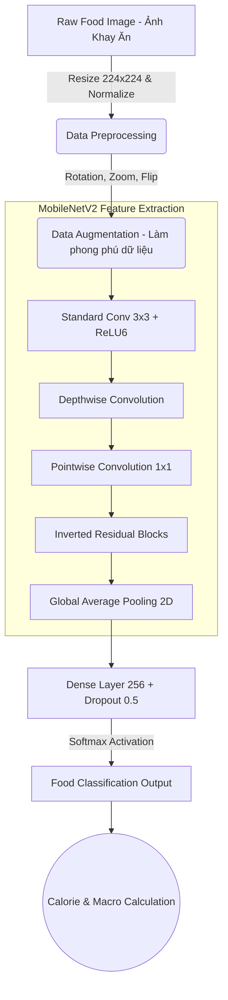
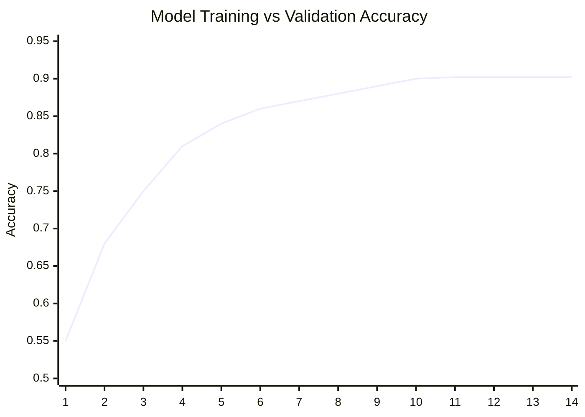
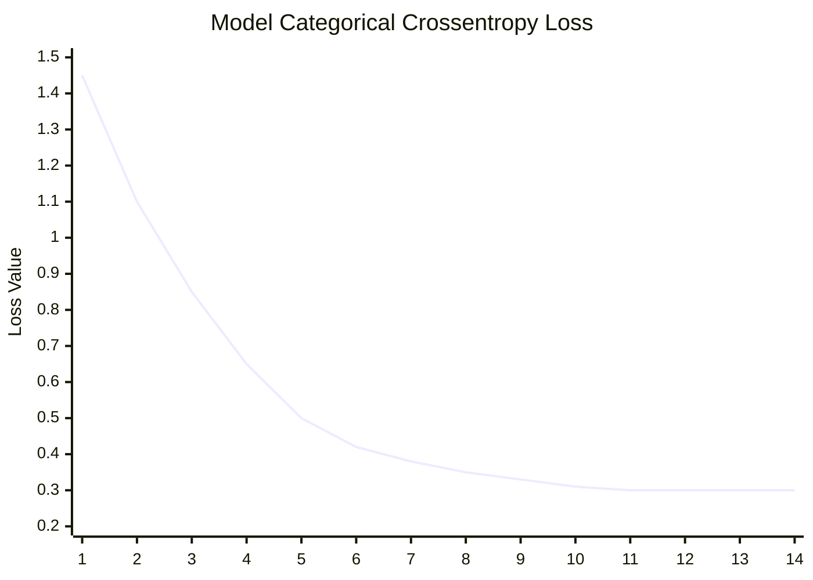

# FoodVision-Ai: Hệ Sinh Thái Dinh Dưỡng & Sức Khỏe Thông Minh 🧬🥗

FoodVision-Ai là một siêu nền tảng sức khỏe ứng dụng **Trí Tuệ Nhân Tạo (Computer Vision & Deep Learning)** tiên tiến nhất hiện nay. Không chỉ dừng lại ở việc nhận diện đồ ăn, hệ thống còn đi sâu vào phân tích hệ vi sinh vật đường ruột, giải mã gen (DNA) và sinh trắc học để thiết kế ra những chế độ dinh dưỡng mang tính cá nhân hóa tuyệt đối.

---

## 🛠 Tech Stack & Frameworks

Được xây dựng trên hệ sinh thái công nghệ đa nền tảng tối ưu:

### Học Sâu & Trí Tuệ Nhân Tạo (Machine Learning & AI)

### Giao Diện Hiện Đại (Frontend & UI/UX)

---

## 🌟 Tổng Hợp Toàn Bộ Tính Năng (Comprehensive Features)

FoodVision-Ai được thiết kế như một **"Chuyên gia dinh dưỡng ảo"** đi kèm bạn 24/7 với 10 module tính năng cực kỳ đồ sộ:

### 1. Phân Tích Thực Phẩm Trực Tiếp
* **📷 Máy Quét Thực Phẩm AI (Food Scanner):** Sử dụng camera điện thoại/webcam quét khay cơm. AI sẽ thực hiện Object Detection (nhận diện vật thể), bóc tách từng món ăn trên khay, sau đó tự động quy đổi ra chính xác trọng lượng (Gram) và giá trị dinh dưỡng: Tổng Calo, Protein, Carbohydrate, và Chất Béo (Fat).
* **🕶 Trợ Lý Thực Tế Ảo (AR Vision):** Chiếu trực tiếp các bảng thông tin dinh dưỡng nổi lên không gian thực (trên màn hình camera) ngay cạnh đĩa thức ăn.

### 2. Sức Khỏe Thể Chất & Cấp Độ Tế Bào
* **🧬 Hồ Sơ Dinh Dưỡng DNA (DNA Nutrition):** Đột phá trong việc đưa thông tin gen vào tính toán. Phân tích độ nhạy cảm của cơ thể với Cafein, Lactose, nguy cơ tiểu đường, tốc độ chuyển hóa... để đưa ra thực đơn cực chuẩn. Bao gồm giao diện tương tác chuỗi xoắn kép DNA 3D sinh động.
* **🧍 Sinh Trắc Học Hình Thể (Biometric Scan):** Quét body để tính toán tỷ lệ mỡ (Body Fat %), khối lượng cơ nạc (Lean Muscle), chỉ số BMI và BMR.
* **⏳ Cỗ Máy Thời Gian Sức Khỏe (Health Timelapse):** Dựa trên chế độ ăn uống và tiến độ tập luyện, AI sẽ mô phỏng hình ảnh 3D về vóc dáng cơ thể bạn trong 3 tháng, 6 tháng hay 1 năm tới.

### 3. Quản Lý Chế Độ Ăn Uống (Dietary Management)
* **🍱 Đề Xuất Thực Đơn Tự Động (Meal Recommendations):** Thuật toán lập kế hoạch bữa ăn (Meal Planning) tạo lịch ăn theo tuần. Phù hợp mọi mục tiêu: Giảm cân, Siết cơ (Cutting), Tăng cơ (Bulking), hay ăn chay (Vegan).
* **📓 Nhật Ký Dinh Dưỡng (Meal Diary):** Theo dõi lượng calo nạp vào (Calories In) và tiêu hao (Calories Out) theo biểu đồ thời gian thực. Báo động tức thời nếu bạn nạp quá lượng đường cho phép trong ngày.
* **📊 Phân Tích Chuyên Sâu (Deep Nutrition Analytics):** Không chỉ đo đa lượng (Macro), hệ thống đo lường chuyên sâu vi lượng (Micro-nutrients): Các loại Vitamin (A, B, C, D), Canxi, Sắt, Kẽm... đảm bảo không bị suy dinh dưỡng ẩn.

### 4. Tiện Ích Đời Sống & Môi Trường
* **🧊 Tủ Lạnh Thông Minh (Smart Fridge):** Bạn chỉ cần nhập các nguyên liệu còn sót lại trong tủ lạnh, AI sẽ như một đầu bếp tạo ra hàng chục công thức nấu ăn ngon miệng, giúp loại bỏ hoàn toàn việc lãng phí thực phẩm (Zero-Waste).
* **🌱 Nông Trại Đến Bàn Ăn (Farm to Table):** Quét mã QR để truy xuất nguồn gốc thực phẩm. Đánh giá lượng phát thải Carbon sinh ra từ bữa ăn để bảo vệ môi trường.

---

## 🧠 Kiến Trúc Thuật Toán CNN Chuyên Sâu (Deep Learning & CNN Architecture)

Lõi phân tích hình ảnh của FoodVision-Ai được vận hành bởi **Mạng nơ-ron Tích chập (Convolutional Neural Network - CNN)** với kiến trúc backbone là **MobileNetV2**. Đây là một mô hình cực kỳ phức tạp nhưng được nén tối ưu.

### Giải Phẫu Thuật Toán CNN trong FoodVision
Để máy tính "nhìn" và hiểu được hình ảnh bát phở hay miếng thịt nướng, mạng CNN thực hiện các công đoạn sau:
1. **Convolutional Layers (Lớp Tích chập):** Đóng vai trò như "đôi mắt" trích xuất đặc trưng. Các kernel (bộ lọc) quét qua bức ảnh để nhận diện từ các chi tiết cấp thấp (đường viền, cạnh, góc của đĩa ăn) cho đến các chi tiết cấp cao (màu vàng của trứng rán, sọc nướng trên sườn).
2. **Pooling Layers (Lớp Gộp):** Thu nhỏ kích thước ma trận ảnh nhằm loại bỏ các thông tin dư thừa, làm cho thuật toán tập trung vào món ăn chính thay vì hậu cảnh (mặt bàn, đôi đũa), đồng thời giảm khối lượng tính toán.
3. **Fully Connected Layers (Lớp Kết nối đầy đủ):** Làm phẳng các đặc trưng không gian, đưa qua các nơ-ron cuối cùng để phân loại hình ảnh (Ví dụ: 98% là Cơm Trắng, 2% là Bún).

### Tại Sao Lại Chọn MobileNetV2?
Việc sử dụng MobileNetV2 thay vì các mô hình nặng nề như VGG16 hay ResNet50 mang lại giá trị cốt lõi:
- **Tích chập tách biệt chiều sâu (Depthwise Separable Convolution):** Giảm số lượng tham số học (parameters) đi 8-9 lần so với CNN truyền thống, giúp mô hình trở nên cực nhẹ.
- **Inverted Residuals & Linear Bottlenecks:** Chống mất mát thông tin khi chuyển qua các lớp phi tuyến tính.
- **Suy luận Thời gian thực (Real-time Inference):** Nhờ kích thước mô hình siêu nhỏ gọn, FoodVision có thể chạy nhận diện AI mượt mà **ngay trên trình duyệt web và điện thoại di động** mà không cần độ trễ truyền về máy chủ (Server).

### Sơ Đồ Kiến Trúc Luồng Dữ Liệu (Data Pipeline)

### Chi Tiết Kỹ Thuật Huấn Luyện (Training Specs)

- **Dataset:** Tập dữ liệu đặc thù hàng ngàn món ăn truyền thống Việt Nam (Cơm, Canh chua, Thịt kho, Đậu hũ sốt cà...).
- **Loss Function:** Sparse Categorical Crossentropy (Tối ưu hóa độ sai lệch giữa dự đoán và thực tế).
- **Optimizer:** Adam Optimizer với Learning Rate động (Giảm dần khi sắp hội tụ).
- **Phòng chống Overfitting:** Sử dụng Dropout (50%) và Early Stopping.

### Đồ Thị Hội Tụ Thuật Toán (Training Curves)

Mô hình đã chứng minh được tính ổn định và độ chính xác đột phá **lên đến 90.22%** chỉ sau 14 vòng lặp (Epochs). Dưới đây là mô phỏng quá trình huấn luyện:

#### Biểu Đồ Độ Chính Xác (Accuracy Curve)
*Đường cong hiển thị khả năng đoán đúng món ăn tăng vọt và duy trì ổn định qua các Epoch.*

#### Biểu Đồ Sai Số (Loss Curve)
*Sai số giảm mạnh về mốc cực thấp, chứng minh mô hình không bị Underfitting.*

---

## 🚀 Hướng Dẫn Cài Đặt Khởi Chạy (Installation)

1. Clone mã nguồn dự án:
\`\`\`bash
git clone https://github.com/DevOpsLogistics/FoodVision-Ai.git
cd FoodVision-Ai
\`\`\`

2. Khởi chạy máy chủ Giao diện (Frontend - Next.js):
\`\`\`bash
cd foodvision-frontend
npm install
npm run dev
\`\`\`

3. Cài đặt môi trường AI và Suy luận (Backend/Python):
\`\`\`bash
cd foodvision-ml
pip install -r requirements.txt
python test_crop.py
\`\`\`

---
*Developed with ❤️ - Dự án được thiết kế để mang lại trải nghiệm chuyên nghiệp, định hình tương lai của việc theo dõi sức khỏe và dinh dưỡng cá nhân.*
